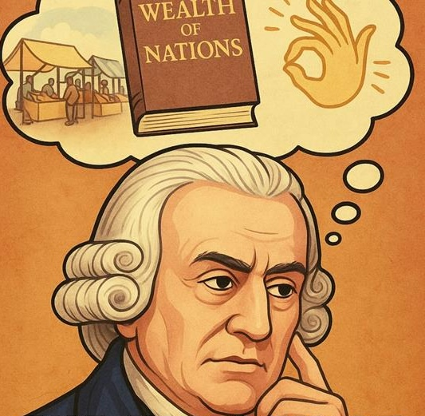

Economics is the science of choice under <i>scarcity</i>. Available resources – time, money, productive capacity – are limited, and this must be taken into account as we pursue our goals. Every decision therefore involves a compromise – a <i>trade-off</i>, as economists call it: obtaining something always implies giving up something else. Economics is present in all the "ordinary business of life", as Alfred Marshall once said: when a household chooses between brand $X$ and brand $Y$, or decides whether to insure its car against theft; when an entrepreneur wants to hire a worker and the worker considers whether to accept the contract; or when a government introduces a green bonus or raises fuel taxes.

Microeconomics studies how individual agents – households, firms, and governments – face these trade-offs, allocating scarce resources among alternative uses. It analyzes how prices are determined, how demand and supply for goods and services take shape, who buys, who sells, and how the interaction of individual decisions affects collective well-being. To begin, let’s start from the simplest possible case.

Imagine some arbitrary good – an apple, a bottle of water, a book. There is only one unit of the good available, and there are two people: Carmen, the current owner of the good, and Bruno, who is interested in buying it. Bruno values the good at 8 euros: he is <i>willing to pay</i> up to 8 euros to obtain it. Carmen, on the other hand, would be willing to give it up for any amount above 5 euros: this is her <i>willingness to sell</i>, a value that may reflect how much Carmen appreciates the good, or – and this will be

An important exception will be the labor market, where the good being traded – time – is not produced by a firm, but sold by the individual who owns it (the worker).

the most frequent case in the markets we will analyze – may represent the cost required to produce the unit, if Carmen is the owner of a firm that produces the good and the good does not yet exist.

Since

Bruno’s valuation is greater than Carmen’s, it is natural to expect that they will agree to trade the good at a price between 5 and 8 euros, say 6.50. Bruno gets something he values at 8 euros, paying only 6.50: he thus obtains a <b>surplus</b> of 1.50 euros. Carmen receives 6.50 euros for something that was worth (or cost) 5: she also obtains a surplus of 1.50 euros. The sum of the two gains – 3 euros – is the <b>total surplus</b> generated by the exchange: a monetary measure of the overall value created.

What happens if, for some reason, the trade does not take place? In that case, neither Bruno nor Carmen gets anything, and the total surplus is zero. The value the trade could have generated, but did not – 3 euros – is a <b>deadweight loss</b>: a potential benefit that the market fails to realize.

Now suppose there are two buyers: Bruno, who values the good at 8 euros, and Alan, who is willing to pay up to 10 euros. Carmen is still willing to sell at 5 euros. In this case, it is natural to expect the good to go to Alan, who values it more. This outcome has an important property: it generates the highest possible total surplus, equal to 10 − 5 = 5 euros. It is a first example of an <b>efficient allocation</b>: given scarcity, resources are allocated where they create the most value – deadweight loss is zero. If the good went instead to Bruno, the trade would generate only 3 euros of surplus: value would still be created, but there would be a deadweight loss of 2 euros. Finally, if the good were not traded at all, the entire 5 euros of potential surplus would be wasted – the deadweight loss would be even larger, 5 euros.

<h2 id="subsec_trade5">Demand, Supply, and Prices</h2>

What happens when we add more participants to the market? Suppose, for example, that there are five sellers – each owning one unit of the good – and five buyers, whose willingness to sell and willingness to pay are shown in the following table:

<!-- <a id="tab_1.1.1"><strong>Tabella 1.1.1</strong></a> -->
<!---light blue = #d0eeff --->
<!---darker blue = #a2d0e9 --->
<!---light red = #ffa8a8 --->
<!---darker red = #ffd0d0 --->
<!---buyer darker color = #d5e1aa --->
<!---buyer light color = #e8f8c0 --->
<!---seller darker color = #f8e3c0 --->
<!---seller light color = #f8f4e1 --->

  <table class="alf">
    <tr>
      <th style="width:20%"> Buyer </th>
      <th style="width:10%"> Value </th>
      <th style="width:20%"> Seller </th>
      <th style="width:10%"> Value </th>
    </tr>
    <tr> <td>Alan</td> <td>10</td> <td>Erika</td> <td>9</td> </tr>
    <tr> <td>Bruno</td> <td>8</td> <td>Diana</td> <td>7</td> </tr>
    <tr> <td>Christian</td> <td>6</td> <td>Carmen</td> <td>5</td> </tr>
    <tr> <td>Diego</td> <td>4</td> <td>Barbara</td> <td>3</td> </tr>
    <tr> <td>Eduardo</td> <td>2</td> <td>Alice</td> <td>1</td> </tr>
  </table>

It is clear that some trades would be mutually beneficial: certain buyers value the good more than the amount some sellers are willing to accept in order to part with it. But which trades will actually take place? And more importantly, how will the agents manage to coordinate and make them happen?

In market economies like the one we live in, coordination among individual decisions happens through <b>prices</b>. In particular, in Part I of these notes we will focus on <b>competitive</b> markets, that is,

In other settings, which we will explore starting in Part II, some agents are <i>price-makers</i>, meaning they have the power to influence the price. But even in those cases, the price remains the central tool for guiding choices and transmitting information.

markets where many buyers and sellers interact freely, and the price emerges spontaneously based on their willingness to pay and willingness to sell. Each agent, being too small to influence the price alone, behaves as a <b>price-taker</b>: they take the price as given and decide how much to buy or sell – or, as we will say, how much to <b>demand</b> or <b>supply</b>.

What price will arise in our small economy? If the price is too high, many sellers are willing to sell, but few buyers want to purchase: there is <i>excess supply</i>, so sellers are <i>rationed</i> – some sellers are left out, even though they are willing to sell at that price or even lower. If the price is too low, few sellers are willing to sell, while many buyers would like to buy – there is <i>excess demand</i>, and this time buyers are rationed. In both cases, some mutually beneficial trades do not occur: a deadweight loss arises. But if the market functions properly – that is, if negotiations are free from obstacles – there will be pressures pushing the price downward in the first case and upward in the second. Only when the quantity demanded equals the quantity supplied does rationing disappear and the price stabilize: at that level, the market is in <b>equilibrium</b>.



Exchanging the good at the equilibrium price—in Figure 1.1, any price between $5$ and $6$ euros—solves the problem of scarcity: since there are not enough units for everyone, the market selects

Adam Smith described the market mechanism as an “invisible hand” which, though driven by the individual interests of consumers and firms, leads to a spontaneous order and an efficient collective outcome.

the participants who value the good the most—Alan, Bruno, Christian, Diana, and Erika (if Diana and Erika are firms, this means that in equilibrium they will not produce or sell anything). The resulting allocation is <b>socially efficient</b>. No one can propose an alternative that would be acceptable to all.

Let’s look again at Figure 1.1. In equilibrium, only Alice, Barbara, and Carmen sell, and only Alan, Bruno, and Christian buy. The total surplus generated is $15$ euros. Now suppose we allow everyone to trade: five sellers with five buyers, choosing prices so that each pair gets a surplus of $0.5$ euros—Eduardo buys from Alice, Diego from Barbara, Christian from Carmen, and so on. This egalitarian solution would generate a total surplus of just $5$ euros—besides likely being harder to implement.

But precisely because the total surplus is low, we can do better. If we cancel the least valuable trades—reassigning to Diana and Erika the units that had gone to Diego and Eduardo—we return to the equilibrium allocation, with total surplus $15$ euros. To make this reallocation acceptable to everyone, we can use part of the extra surplus to compensate the four excluded agents: Eduardo, Diego, Diana, and Erika. By paying each of them $1$ euro—more than the $0.5$ they received in the first allocation—and splitting the remaining $11$ euros among the six who participate in the trade, we obtain an allocation that is unanimously preferred. Everyone is better off, which shows that the first allocation was not efficient. The equilibrium one is.

The example we have just discussed is very simple: few agents, each buying or selling exactly one or zero units. But suppose the good being traded is, say, 1 kg of pasta. This interpretation is helpful—it lets us connect that simplified context to the functioning of a real market—but it also reveals some limitations of such a simple model. To begin with, it doesn’t make much sense to assume that each consumer buys either one or zero kilograms of pasta: in reality, they can buy more or less, even fractional quantities. The same applies to producers: they can supply many units, not just one. So we need to generalize the analysis to allow demanded and supplied quantities to be neither whole numbers nor limited to a single unit.

Another limitation is that the values we assigned to agents aren’t set in stone. Would Alan, Bruno, and the others still have the same willingness to pay if their income were different, or if there were a substitute good—like rice—sold for just a few euros in another market? And would the sellers Alice, Barbara, and the rest still be willing to sell at the equilibrium price if an input—like durum wheat—became more expensive? In other words, the numbers we have so far treated as fixed actually reflect underlying conditions we haven’t yet made explicit: income, the prices of other goods and of inputs, and so on.

To overcome these limitations and make the analysis more realistic and applicable, we need to move from a “point-by-point” representation of demand and supply to <i>continuous curves</i> that describe the quantity demanded and supplied as depending on <i>other variables</i> besides the price of the good. That is exactly what we will do in the next section, introducing a general model that preserves the core logic we’ve already seen—price, quantity, surplus—but allows us to systematically analyze how market equilibrium forms, and how the market responds when something changes.

