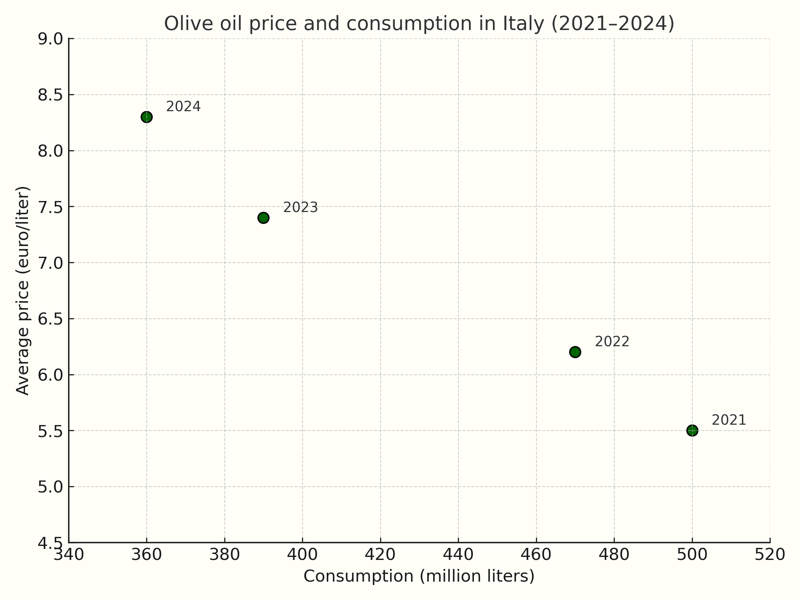
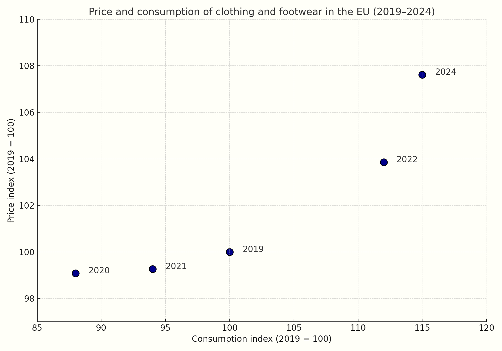

To analyze how a competitive market works, economists rely on a model that is simple but very useful—of which <a href="{{ site.baseurl }}/en/I/1/1#gr_intro/trade5">Figure 1.1</a> from the previous section is an initial example: the <b>demand and supply model</b>. The basic idea is that, for each possible price, there are two quantities: the <b>quantity demanded</b>, meaning how much consumers wish to buy at that price, and the <b>quantity supplied</b>, meaning how much sellers are willing to sell. It is then assumed that the market price forms at the point where these two quantities coincide: the <b>market equilibrium</b>.

<h2 id="subsec_intro-demand">Demand</h2>

The <b>demand curve</b> for a good shows, for each possible price, how many units of the good consumers collectively wish to purchase, <i>holding fixed all other variables</i> that influence this quantity: the number of consumers, their income, their preferences, the prices of other goods, and so on.

A good way to understand what “holding the rest fixed” means is to think in terms of a function. As an example, suppose the good in question is pasta, and that the quantity demanded (measured in kilograms consumed each week) is given by

\(\begin{gathered}
Q_{\text{pasta}} = N_{\text{cons}} \times \big( 0.002 \times M - 0.3\times P_{\text{pasta}} + 0.1\times P_{\text{rice}} \big)
\end{gathered}\)

where $N_{\text{cons}}$ is the number of consumers in the market, and the expression in parentheses is the <b>individual demand</b>, i.e. the quantity demanded by each individual consumer. This individual demand depends negatively on the price of pasta ($P_{\text{pasta}}$) and positively on the individual’s weekly income ($M$) and on the price of a <i>substitute</i> good, rice ($P_{\text{rice}}$).

If we fix the values of $N_{\text{cons}}$, $M$, and $P_{\text{rice}}$, we obtain a one-to-one relationship between $P_{\text{pasta}}$ and $Q_{\text{pasta}}$. <i>This relationship is the market demand curve</i> for pasta. For instance, if there are $1000$ consumers, each earning $500$ euros per week, and the price of rice is $2$ euros/kg, then the demand function for pasta becomes $Q_{\text{pasta}} = 1200 - 300P_{\text{pasta}}$. If the price of pasta is 1 euro/kg, the quantity demanded will be 900 kg per week; if it is 1.50 euros/kg, the quantity will be 750 kg, and so on.

It should now be clear that, depending on the values assigned to $N_{\text{cons}}$, $M$, and $P_{\text{rice}}$, the relationship between $P_{\text{pasta}}$ and $Q_{\text{pasta}}$ will be different. We can therefore distinguish between two types of variation: if the price of the good changes, we move <i>along the curve</i>. If one of the variables we had held fixed changes, the <i>curve itself shifts</i>.



<h2 id="subsec_intro-supply">Supply</h2>

The <b>supply curve</b> of a good represents the relationship between the price of the good and the number of units producers are collectively willing to sell at that price, holding fixed the number of firms, their technology, input prices, and so on. Continuing with the pasta market example, suppose that the quantity supplied is given by

\(\begin{gathered}
Q_{\text{pasta}} = N_{\text{firms}} \times \left(\frac{100 \times P_{\text{pasta}} }{P_{\text{input}}}\right)
\end{gathered}\)

where $N_{\text{firms}}$ is the number of firms in the market, and the expression in parentheses is the <b>individual supply</b>, i.e. the quantity supplied by each firm. This quantity depends negatively on $P_{\text{input}}$, the price of the input used by the firm, and positively on $P_{\text{pasta}}$, the output price.

If we fix $N_{\text{firms}}$ and $P_{\text{input}}$, we obtain a one-to-one relationship between $P_{\text{pasta}}$ and $Q_{\text{pasta}}$—this is the market supply curve for pasta. If $N_{\text{firms}}$ or $P_{\text{input}}$ changes (or the firms’ technology, which we are not yet treating as a variable but will do so later), for example if the input price increases or the number of firms decreases, the curve shifts to the right.



<h2 id="subsec_intro-equilibrium">Market Equilibrium and Changes in Market Equilibrium</h2>

Now that we have introduced demand and supply, we can bring them together. The model assumes that the price settles at the equilibrium level—meaning the point where demand and supply coincide. This point is a “snapshot” of the market: it describes the prevailing price and the quantity exchanged.

But if all we wanted was to know how much a good costs and how much of it is sold, we could simply look at the data—the equilibrium point, on its own, tells us nothing that a market statistic couldn’t provide. The true usefulness of the model emerges when we ask <i>why</i> the market is at that point and <i>what happens when something changes</i>.

In fact, the concept of equilibrium also has a dynamic interpretation: it describes a <i>stable</i> situation. If the price deviates from the level that equates demand and supply, forces emerge that tend to bring it back. A price that is too high leads to excess supply (unsold inventory), pushing sellers to lower the price. A price that is too low leads to excess demand, causing the price to rise. In the absence of external changes, the system tends to stay close to equilibrium.

But precisely because these adjustment forces exist, the model helps us understand what happens when something does change. If, for instance, consumer income changes, or the price of a substitute good changes, or input costs rise, one of the curves shifts. What was previously an equilibrium suddenly is not anymore: the quantity demanded no longer matches the quantity supplied. The market enters a state of <i>disequilibrium</i>, and the same pressures that once kept the system in balance now push it toward a <i>new</i> equilibrium. This is where the model reveals its real value: it allows us to identify <i>shocks</i> and anticipate how price and quantity will respond.



The adjustment

We are not claiming that the supply and demand model is “true,” nor that the explanation it offers is the only possible one: reality is always more complex than any simplified narrative. Economics is an empirical science: an economic model is a tool for interpreting behavior, and it is judged by how well it helps us understand what we observe.

mechanisms illustrated in the figure are not just theoretical constructs. They appear in real markets. In the examples that follow, we’ll look at two concrete cases where a shock affected either demand or supply, and the market reacted just as the model predicts.

<h3 id="subsec_intro-evo">Extra virgin olive oil</h3>

Between 2021 and 2024, the Italian market for extra virgin olive oil experienced a series of negative supply shocks caused by prolonged drought, the spread of Xylella, and production declines in exporting countries such as Spain. The supply of the product gradually decreased, shifting the supply curve to the left: as shown in the graph below, consumer prices increased each year, while the quantity purchased declined. This sequence of negative supply shocks moved the equilibrium further and further northwest along the demand curve.

	Sources: <a href="https://www.ismeamercati.it">ISMEA</a>, <a href="https://www.internationaloliveoil.org">IOC</a>, based on data 2021–2024

<h3 id="subsec_intro-gas">Clothing and Footwear in the EU</h3>
Between 2020 and 2024, the European market for clothing and footwear experienced a sequence of demand shocks. The pandemic initially caused a sharp reduction in spending on non-essential goods, shifting the equilibrium southwest along the supply curve: both consumer prices and quantities purchased fell. Starting in 2021, the gradual recovery of mobility, tourism, and social life reactivated demand, generating a continuous movement northeast, still along the same supply curve. As shown in the graph below, the quantity consumed has grown year after year, accompanied by a progressive increase in prices.

Sources: <a href="https://www.eea.europa.eu/en/circularity/sectoral-modules/textiles/consumption-of-clothing-footwear-and-household-textiles-per-person?utm_source=chatgpt.com">EEA</a>, <a href="https://ec.europa.eu/eurostat">Eurostat</a>, based on data 2019–2024

 

 

The two figures above are not hypothetical examples. They recount <i>real</i> events that occurred in <i>real</i> markets, where price and quantity changed with significant consequences for collective well-being. Of course, the demand and supply model does not capture all the complexity of those phenomena. But it offers a useful conceptual map: it helps us understand what happened, and what forces drove the adjustment.

But important questions remain: where do demand and supply curves come from? And why do the areas beneath or above them measure something as important as the welfare of consumers and producers? In the next chapters we will take a closer look into the behavior of buyers and sellers: we’ll study consumer choices, production decisions, and then return to the topic of equilibrium with stronger tools in hand. Later in these notes, we will use this framework to analyze particularly important markets—such as those for labor and credit—and to understand what happens when the price mechanism fails to work as it should, for example in the presence of market power or informational problems.

<h2 id="subsec_marshall">Partial and General Equilibrium</h2>

We conclude this chapter with a methodological note. As we mentioned earlier, markets are interconnected: the price of one good also depends on what happens in other markets. For example, an increase in the price of rice shifts the demand for pasta to the right, raising its equilibrium price and quantity. But if pasta becomes more expensive, the demand for rice also shifts to the right, further increasing the price of rice, and so on. What sense, then, does it make to speak of a shock in a single market without considering the chain effects on others? Shouldn’t we analyze all markets together, in one big system?

This

Arrow and Debreu (Nobel Prize in Economics 1972 and 1983, respectively) provided the first rigorous mathematical proof of the existence of general equilibrium.

is the distinction between <b>general equilibrium</b> and <b>partial equilibrium</b>. In the general equilibrium model, introduced by Léon Walras at the end of the nineteenth century and rigorously formalized in the last century by Kenneth Arrow and Gérard Debreu, all markets are considered simultaneously: equilibrium prices are those that make the decisions of consumers and firms consistent across the entire economy. The two <i>fundamental theorems of welfare economics</i> link competitive general equilibrium to efficiency: the first theorem states that every competitive equilibrium is efficient — it is not possible to find another set of trades that makes everyone better off. The second states that any efficient allocation can be achieved as a competitive equilibrium, provided one starts from an appropriate initial distribution of resources.

The approach we will follow

Alfred Marshall is regarded as the father of partial equilibrium. In his <a href="https://oll-resources.s3.us-east-2.amazonaws.com/oll3/store/titles/1676/Marshall_0197_EBk_v6.0.pdf" target="_blank">Principles of Economics</a> he acknowledged that all markets are interdependent, but argued that — especially if the market under analysis is relatively small and the indirect effects on others negligible — it was still useful to analyze one market at a time, keeping external conditions constant. His approach became the basic “toolkit” for analyzing markets, policies, and welfare.

in these notes is instead that of partial equilibrium, due to Alfred Marshall. In partial equilibrium analysis, one studies a single market, for example the pasta market, taking as given the prices in other markets, such as rice (a substitute good) or labor (an input). The equilibrium of that market is then calculated on the basis of its own demand and supply, without asking whether the prices in other markets (on which demand and supply depend, as we have seen) are themselves equilibrium prices consistent with the one just determined. In other words, we analyze one piece of the economic system without “closing the circle” of interdependence among markets.

This method has the advantage of being simpler and more straightforward, while still providing a good approximation in many cases, because the indirect effects that propagate to other markets tend to become progressively smaller along the chain of interdependencies. For this reason, in the following pages we will use partial equilibrium as the main tool for analyzing competitive markets, while keeping in mind that it represents a piece of a broader theoretical framework, that of general equilibrium.

