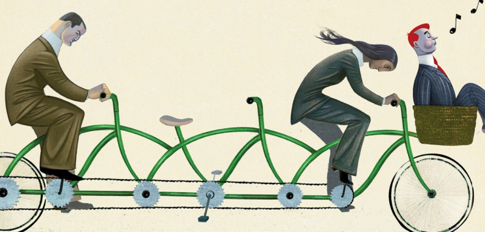

Another situation in which the market left to itself does not lead to an efficient outcome is that of public goods, such as national defense, cleaning and public order, street lighting, and basic scientific research. A public good presents two fundamental differences compared to a private good such as a smartphone or a kilo of apples: non-rivalry (the consumption of one individual does not reduce that of others) and non-excludability (it is impossible to prevent someone from benefiting from it). Once provided, anyone can benefit from it, regardless of whether they contributed to its provision, and no one can be excluded.

The source and form of inefficiency

The problem arises from the phenomenon of the <b>free rider</b>: since the benefit is available to all regardless of who contributed, individuals choose to “ride for free” by not paying, expecting others to bear the cost.

are similar to those seen in the previous section for a private good that generates positive externalities. Even in the case of public goods, the benefits extend to all members of the community, but when each individual decides whether and how much to contribute, they take into account only their personal advantage. In the absence of government intervention, the market left to itself leads everyone to reason this way. The result is that the good is not provided, or is provided in a smaller quantity than would be socially desirable.

  

<h2 id="subsec_public-good-game">The public good game</h2>

Let us imagine a neighborhood inhabited by only two residents, Alice and Bruno, who can each contribute 10 euros per week to clean the park (C) or not contribute at all (NC). Each contribution costs 10 to the one who pays, but generates a benefit of 8 euros for each resident. If one of the two contributes and the other does not, the first pays 10 and receives a benefit of 8, obtaining a negative surplus of $–2$. The other pays nothing but still receives the benefit, obtaining a surplus of 8. If both contribute, each pays 10 but receives 16, obtaining a surplus of 6. If neither contributes, both remain at 0.



 

This game is a prisoner’s dilemma! Contributing jointly is socially efficient, but each has an incentive not to do so: for both, not contributing is a dominant strategy. The result is that no one contributes, and the park remains dirty.

With only two residents, one might think that the problem could be solved through direct bargaining: Alice and Bruno could agree — legally binding themselves through a contract — to both contribute to cleaning the park. But when there are many more residents, this becomes a remote possibility: imagining that dozens, hundreds, or thousands of people sit down at a table to decide what to do is not realistic.

The point, however, is that with many residents the problem does not change in substance. Suppose there are 1000 of them, each with the possibility of contributing 10 euros, and suppose again that each contribution generates 8 euros of benefit for each resident. From the individual’s point of view, the calculation remains the same: the incentive to free ride remains. Take Bruno, one of the thousand inhabitants. Suppose Bruno expects $N$ of his 999 fellow citizens to contribute. If he contributes, the contributors become $N+1$. Bruno’s benefit, net of his contribution, is therefore $(N+1)\times 8-10$. If he does not contribute, Bruno obtains $N\times 8$, that is, $8$ euros less in benefit, but also 10 euros less spent. Even in the public good game with 1000 players, not contributing is the dominant strategy for everyone.