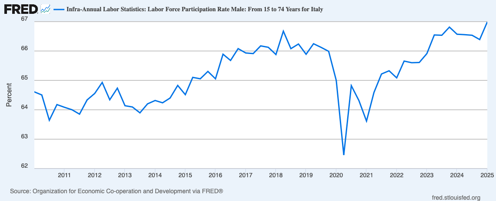

Our theory of the consumer's choice assumes that in making these choices individuals take their income as given. In reality, a consumer's income depends for the greater part on the consumer's <i>labor choices</i>, that is, how much time to sell to those who demand it (namely firms, as we will see in the <a href="{{ site.baseurl }}/en/IV/9/2">next section</a>). Fortunately, analyzing these choices does not require a new theory. As we shall now see, labor supply can be analyzed by studying demand for leisure.

<h2 id="SUBSEC_LS1">The Consumer/Worker's Budget Constraint</h2>

Consider a consumer/worker who must decide how much free time to have (and hence how much to work) and how much of a generic good to consume. Let us write $T$ for the total time the individual is endowed with (e.g. 7 days per week), $N$ for the days of leisure ($0\leq N\leq T$), and $C$ for the quantity of the good the individual consumes. The individual's objective is to maximize utility $U(N,C)$ subject to her budget constraint. To understand the budget constraint faced by the consumer/worker, denote by $P$ the price of consumption, by $W$ the daily wage, and by $M_0$ the non-labor income of the individual. The budget constraint is then

\(\begin{gathered}
 PC = M_0 + W(T-N)
\end{gathered}\)



 

<h2 id="SUBSEC_LS2">Optimal Choice and Individual Labor Supply Function</h2>

The worker decides how to allocate their time between work and leisure, knowing that more time devoted to work means less leisure but also more income (and therefore more consumption), according to their preferences and the budget constraint. With Cobb–Douglas preferences

 \(\begin{gathered} U(N,C) = N^\alpha C^\beta \end{gathered}\) 

the optimum is often an interior solution: the individual chooses to work a certain number of days and to keep part of the time for themselves. In fact, with this type of preferences utility is zero if one of the two goods is absent, so the worker has an incentive to consume both.

However, even

From our analysis of consumption choices (<a href="{{ site.baseurl }}/it/I/2/3#SUBSEC_OPT">Chapter 2</a>) it should be clear that, even if non-labor income is equal to zero, and therefore the budget constraint touches the horizontal axis, the corner solution with $N=T$ is possible (as is the one with $N=0$) if the worker’s utility function is $U(N,C) = (N+\sigma)^\alpha (C+\sigma)^\beta$ with $\sigma>0$.

with Cobb–Douglas preferences a <i>corner solution</i> may occur where the individual does not work at all. If non-labor income $M_0$ is sufficiently high and the real wage $W/P$ sufficiently low, working becomes unattractive: the individual prefers not to participate in the labor market, choosing $N=T$.

The following figure shows how the optimal choice of leisure and consumption varies with the parameters of the utility function ($\alpha$ and $\beta$), non-labor income $M_0$, the wage $W$, and the price of consumption $P$.



It is important

In Italy, labor force participation has increased from about 61% in 2010 to about 67% in 2025.

to emphasize that a zero labor supply does not correspond to the worker’s <i>unemployment</i>, but rather to their non-participation in the <i>labor force</i>: the individual voluntarily chooses not to work. Involuntary unemployment — that is, the case of someone who would like to work at the market wage but cannot find a job — cannot occur in equilibrium, whether the market is competitive or, as we will see, characterized by market power on the demand side.

In reality, of course, unemployment very much exists, and in Italy it has historically been particularly high.

Only external interventions, such as a minimum wage set above the equilibrium level, can create involuntary unemployment.

 

<h2 id="SUBSEC_LS3">Market Labor Supply</h2>

Just like we do in every other market, we obtain the labor market supply function simply by adding horizontally the individual labor supply functions. The following figure depicts the market supply function corresponding to a population of identical workers, each with utility function $U(N,C)=NC^2$.



