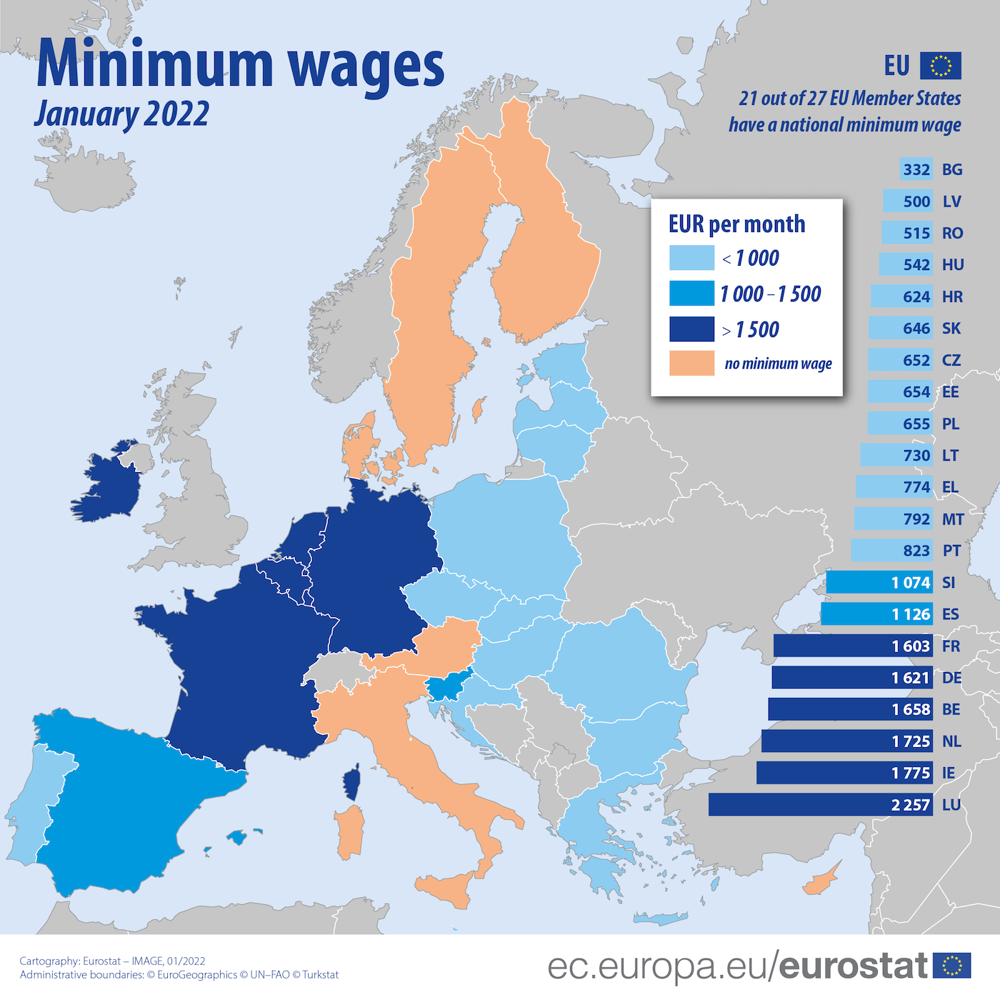

In <a href="{{ site.baseurl }}/en/I/3">Chapter 3</a> we have analyzed the competitive firm's profit maximization problem. In the short run, the firm's optimal choice is  

In the long run, if fixed costs are sufficiently low, the profit maximization rule is the same as in the short run; otherwise, the optimal choice is to shut down.

to produce the quantity of output such that marginal cost equals output price: $MC=P$.

Given that output $Q$ and labor $L$ are linked by a one-to-one relationship, namely the firm's production function $Q=F(L)$, an equivalent way to proceed is to compute the quantity of <i>input</i> that maximizes the firm's profit.

<h2 id="SUBSEC_LD1">Individual Labor Demand</h2>

Instead of inverting the firm's production function and writing the firm's costs and revenues in terms of output $Q$, we can write costs and revenues as a function of the quantity of labor hired by the firm, $L$, as follows:

\(\begin{gathered}
 C = FC + WL
\end{gathered}\)

\(\begin{gathered}
 R = P\times F(L)
\end{gathered}\)

In the short run, the optimal quantity of labor is the one that maximizes the difference $R-C$. As the quantity of input $L$ increases, the firm's cost increases at a rate equal to the derivative of $C$ with respect to $L$, that we call the firm's <b>Marginal Labor Cost</b>. For a competitive firm, this is simply the daily wage:

\(\begin{gathered}
 MLC = \frac{dC}{dL} = W.
\end{gathered}\)

Analogously, the firm's revenue increases at a rate equal to the derivative of $R$ with respect to $L$, which we call the <b>Marginal Labor Revenue</b>, given by the value in euros of the marginal product of labor:

\(\begin{gathered}
 MLR = P\times \frac{dF(L)}{dL}=P\times MP_L
\end{gathered}\)

The quantity of input that maximizes the firm's profit is such that $MLR=MLC$:

\(\begin{gathered}
 P\times MP_L = W
\end{gathered}\)

In other words, the firm's short-run profit-maximizing choice 

We have encountered this rule before. Recalling that $MC=W/MP_L$, it is easy to see that the equation derived here is the same as $MC=P$.

is to hire labor up to the level at which the revenue of an additional unit of labor equals the cost of that unit.

Once we fix the price of the firm's output, $P$, the only two variables left in the equation are the labor price and quantity, namely $W$ and $L$. The equation therefore describes the firm's (short-run) <b>labor demand function</b>: given the firm's technology $Q=F(L)$ and the price $P$ of the good produced by the firm, this function associates each possible wage $W$ with the quantity of labor $L$ that maximizes the firm's profit. 

Let us consider again the example that we discussed in <a href="{{ site.baseurl }}/en/I/3">Chapter 3</a>, where the firm's production function is $Q=F(L)=80\sqrt{L}$. Suppose that the price of output is $P=2.50$. The firm's profit is therefore

\(\begin{gathered}
 2.50\times 80\sqrt{L} -WL
\end{gathered}\)

Setting the derivative of this expression with respect to $L$ equal to zero (that is, equating marginal labor revenue $MLR=2.50\times 80/(2\sqrt{L})$ to marginal labor cost $MLC=W$), we obtain the firm's inverse labor demand function

\(\begin{gathered}
 W=\frac{2.50\times 80}{2\sqrt{L}}
\end{gathered}\)

The firm's labor demand function is therefore

\(\begin{gathered}
 L = \frac{10000}{W^2}
\end{gathered}\)

For example,

We knew already that when $W=64$ and $P=2.50$, the firm's short-run optimal choice is to produce $Q=125$ units of output. See e.g. <a href="{{ site.baseurl }}/en/I/3/3#gr_firm/RC">Figure 3.15</a> or 
<a href="{{ site.baseurl }}/en/I/3/4#gr_firm/supplySR">Figure 3.18</a>.

at wage $W=64$ the quantity of labor demanded by the firm is $L=10000/64^2$, hence the quantity of output supplied by the firm is $Q=80\sqrt{10000/64^2}=125$.

The figure below illustrates the example discussed above. The figure also shows how the firm's labor demand function varies, as we vary productivity (parameter $A$) or the price of output (parameter $P$). 



<h2 id="SUBSEC_LD2">Market Labor Demand</h2>

Labor demand in the entire market is obtained by horizontally summing the labor demands of individual firms, as illustrated in the following figure. At each wage level, we consider how many units of labor each firm wants to employ, and then we add them up. The market demand curve depends on firms’ technology, the output price, and the number of firms operating in the market. In particular, if the output price increases, the labor demand curve of each firm shifts to the right, and consequently the market demand curve also shifts to the right. Similarly, an increase in the number of firms leads to an expansion of the overall demand for labor.



<h2 id="SUBSEC_LEQ">Competitive Equilibrium</h2>

The competitive equilibrium in the labor market is determined, as in all markets, by the intersection of demand and supply. The equilibrium wage is the one at which the quantity of labor that firms wish to hire is exactly equal to the quantity of labor that workers wish to supply. And as in any other competitive market, the equilibrium allocation is socially efficient: the units of labor that are worth more to firms than the wage are employed, and the workers willing to accept that wage find employment.

In the perfect competition model, the equilibrium therefore ensures full employment (given the available supply) and no surplus left unrealized: total surplus (the sum of workers’ surplus and firms’ surplus) is maximized.



<h2 id="SUBSEC_MW1">Minimum Wage</h2>

What

In Europe, most countries have a statutory minimum wage, with different levels. In Italy, however, there is no minimum wage: wage protection relies on collective agreements, but the issue is the subject of political debate.
happens if the State introduces a <b>minimum wage</b>, that is, a level $W_\text{min}$ below which it is not permitted to sign labor contracts?

It is easy to see that if $W_\text{min}$ is lower than the equilibrium wage, it has no effect: the market continues to operate at the original equilibrium point. If instead $W_\text{min}$ is higher than the equilibrium wage, the quantity of labor supplied by workers increases, while the quantity demanded by firms decreases. The result is an excess supply of labor, that is, <i>involuntary unemployment</i>, and a deadweight loss of welfare compared to the absence of intervention.

This outcome represents the standard prediction of the perfect competition model: the minimum wage reduces employment and market efficiency. However, as we will see in the next section, if the labor market is not competitive on the demand side — that is, if the <i>buyers</i>, namely firms, have market power — the effect changes radically: in that case, the minimum wage can <i>increase</i> employment and reduce the deadweight loss.



