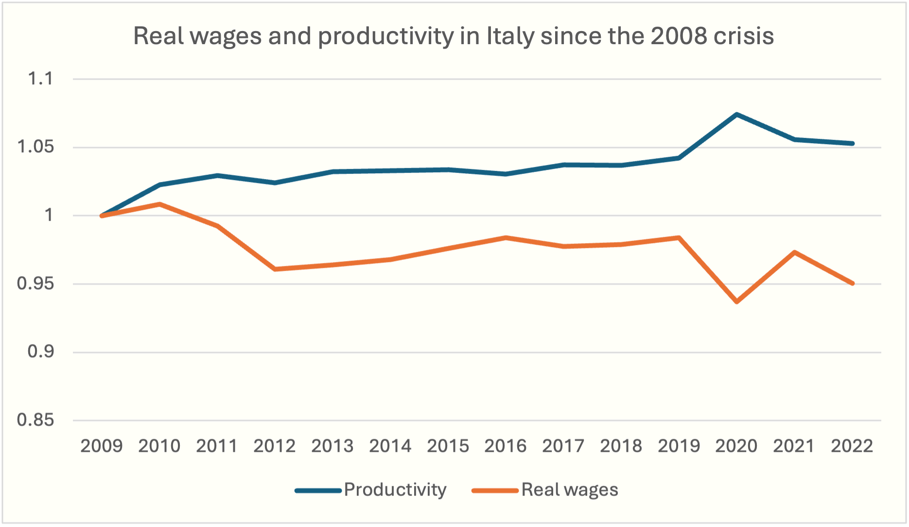

A relevant issue in many labor markets is market power on the demand side, which occurs when there are only a few employers, or perhaps just one. A market where a single buyer is present is called a <b>monopsony</b>.

<h2 id="subsec_monopsony">Monopsonist's Optimal Choice</h2>

The analysis of monopsony mirrors that of monopoly. In a monopolistic market the firm faces a downward-sloping demand curve for its product: the firm knows that selling higher quantities requires fixing a lower price. Analogously, in a monopsonistic labor market the firm faces an upward-sloping labor supply function: the firm knows that hiring more labor requires paying a higher daily wage. As a consequence, the monopsonist's marginal labor cost function is increasing rather than constant.

Let us make an example. Suppose that the (inverse) labor market supply function is $W=20+L/100$. The firm's cost is therefore $C=(20+L/100)\times L$ and hence the marginal labor cost is $MLC=20+L/50$, an increasing function of $L$.

Just like a competitive firm, a monopsonist optimally hires labor up to the point where marginal labor revenue equals marginal labor cost. Compared to a competitive labor market, however, both employment $L^M$ and wage $W^M$  are lower, as we illustrate in the figure below. In the figure we assume that the marginal labor revenue function is  $MLR=80-L/100$.  



<h2 id="subsec_markdown">Monopsonist Markdown</h2>

In the case of monopsony, the concept mirroring the monopolist’s **markup** is the **markdown**, which measures how much the wage paid to workers falls short of their marginal contribution to production. Formally:  

\(\begin{gathered}
\frac{MLR - W}{MLR}
\end{gathered}\)

As with markup, markdown is also linked to the elasticity of labor supply. A high elasticity implies a low markdown, while a low elasticity allows the monopsonist to pay wages well below the value of the marginal product.

In perfect competition, the labor demand condition for a competitive firm (as seen in the previous section) is $W = P \times MP_L$, which can be written as $W/P = MP_L$: the <i>real wage</i> equals the real marginal product of labor. If there were competition, over time we would therefore expect real wages and marginal productivity to move together. The graph below, however, shows that in Italy this is not the case: since 2009, productivity has grown by about 5%, while average real wages have fallen by about 5%, creating a gap of roughly 10 percentage points.

Sources: <a href="https://www.oecd.org/en.html">OECD</a>

This discrepancy suggests the presence of market power on the demand side. Recent estimates by the <a href="https://www.imf.org/en/Home">International Monetary Fund</a> for 10 European countries (including Italy) indicate a median markdown of 40%. On average, firms pay workers only about 60% of their marginal product. In this context, instruments such as the minimum wage can not only increase pay but also employment, as we will now see.

<h2 id="subsec_mw2">Minimum Wage</h2>

In the previous section we saw that, in a competitive labor market, the introduction of a minimum wage above the equilibrium level reduces employment, generating a deadweight loss of welfare. In a monopsonistic labor market, things are different. Just as a price ceiling imposed on a monopolist can increase the quantity produced, in the case of monopsony, in a specular way, a minimum wage can increase the amount of labor employed.

In the absence

 
In 1933, the economist Joan Robinson noted that, in the presence of firms’ market power in the labor market, a minimum wage could increase employment. Decades later, the empirical studies of David Card (Nobel Prize in Economics 2021) and Alan Krueger showed that an increase in the minimum wage did not reduce employment in New Jersey fast food restaurants, contradicting the prediction of the competitive model. These contributions gave rise to a large literature on labor markets.

of intervention, the monopsonist pays a wage lower than the marginal revenue product of labor and hires fewer workers than would be socially efficient. As in monopoly, here too the reason is the price effect: the marginal cost of labor is upward sloping. With the introduction of a minimum wage, however, the marginal cost function of labor changes. Indeed, the days of work that workers would be willing to supply at less than the minimum wage still require an expense equal to the minimum wage, since by law the firm cannot pay less than that. The $MLC$ curve is therefore flat (at the level of the minimum wage) up to the quantity of labor offered at the minimum wage; only beyond that point does it coincide with the marginal cost curve of labor in the absence of intervention. In this interval, the firm can increase employment without having to pay higher wages to other workers.

Consequently, if the minimum wage is set just above the monopsony wage $W^M$, the firm reacts by increasing both wages and employment, with a reduction in deadweight loss. By contrast, a minimum wage set too high ends up reducing employment, as in the competitive model.

We illustrate these conclusions in the following graph.



