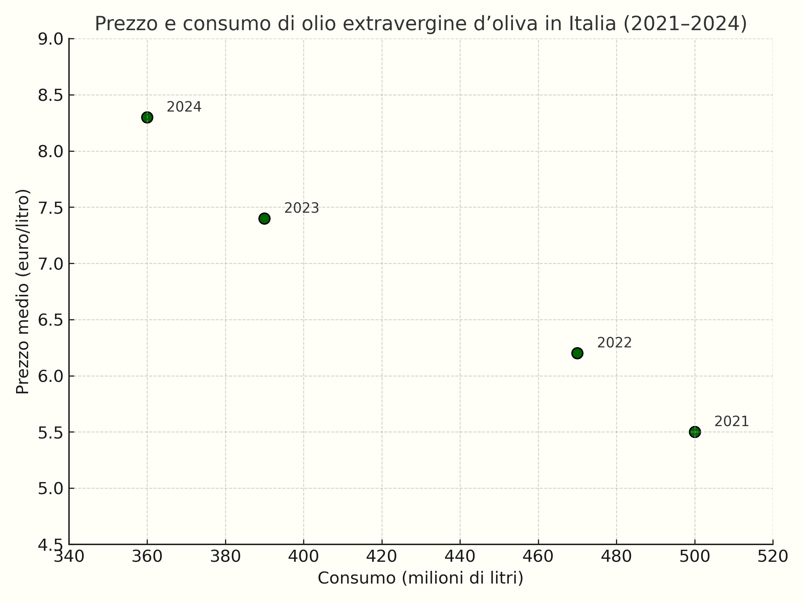
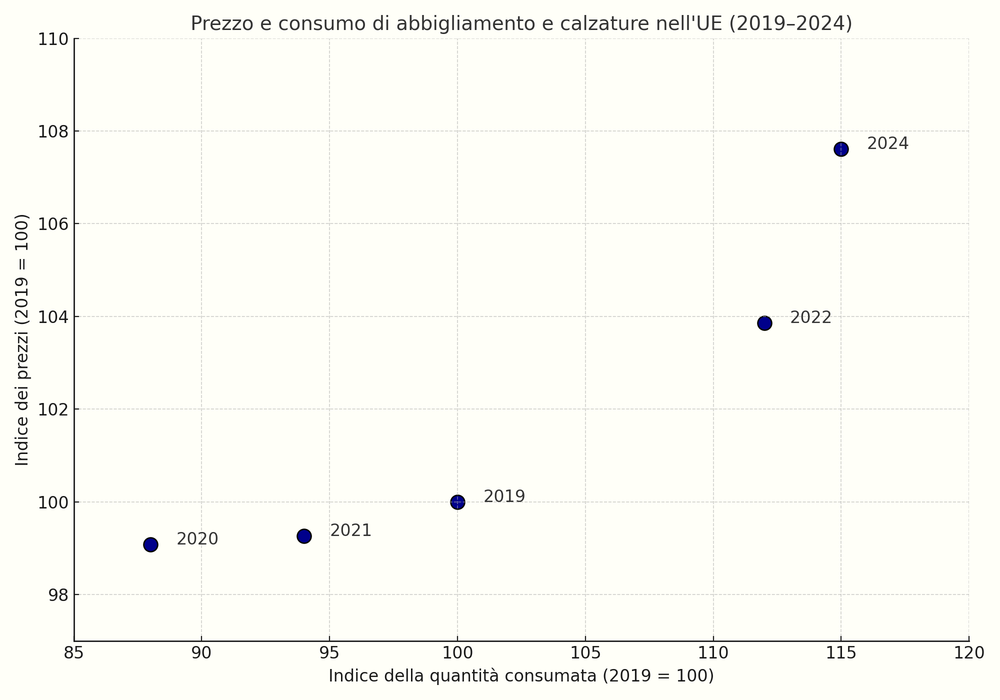
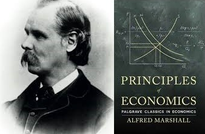

<!--  -->

Per analizzare come funziona un mercato concorrenziale, gli economisti ricorrono a un modello semplice ma molto utile, di cui la <a href="{{ site.baseurl }}/it/I/1/1#gr_intro/trade5">Figura 1.1</a> vista nella sezione precedente è un primo esempio: il <b>modello di domanda e offerta</b>. Si parte dall’idea che, per ogni livello di prezzo, esistano due quantità: la <b>quantità domandata</b>, cioè quanto i consumatori vogliono acquistare a quel prezzo, e la <b>quantità offerta</b>, cioè quanto i venditori vogliono vendere a quel prezzo. Si ipotizza poi che il prezzo di mercato si formi nel punto in cui queste due quantità coincidono: il punto di <b>equilibrio</b> del mercato.

<h2 id="subsec_intro-demand">Domanda</h2>

La <b>curva di domanda</b> di un bene rappresenta, per ogni prezzo possibile, quante unità del bene i consumatori nel loro complesso desiderano acquistare, <i>tenendo fisse tutte le altre variabili</i> che influenzano tale quantità: il numero di consumatori, il loro reddito, i loro gusti, il prezzo di altri beni, e così via.

Un buon modo per capire cosa significa “tenere fisso il resto” è pensare in termini di funzione. Per fare un esempio, supponiamo che il bene in questione sia la pasta e che la quantità domandata (misurata in chilogrammi consumati ogni settimana) sia data da

\(\begin{gathered}
Q_{\text{pasta}} = N_{\text{cons}} \times \big( 0.002 \times M - 0.3\times P_{\text{pasta}} + 0.1\times P_{\text{riso}} \big)
\end{gathered}\)

dove $N_{\text{cons}}$ è il numero di consumatori presenti nel mercato, e l'espressione in parentesi è la <b>domanda individuale</b>, cioè la quantità domandata da ogni singolo consumatore. Quest'ultima dipende negativamente dal prezzo della pasta ($P_{\text{pasta}}$) e positivamente dal reddito settimanale dell'individuo ($M$) e dal prezzo di un bene <i>sostituto</i>, il riso ($P_{\text{riso}}$).

Se fissiamo le variabili $N_{\text{cons}}$, $M$ e $P_{\text{riso}}$, otteniamo una relazione univoca tra $P_{\text{pasta}}$ e $Q_{\text{pasta}}$. <i>Questa relazione è la curva di domanda di mercato</i> della pasta. Se, ad esempio, ci sono $1000$ consumatori, ciascuno guadagna $500$ euro a settimana, e il prezzo del riso è $2$ euro/kg, allora la funzione di domanda di pasta è $Q_{\text{pasta}}=1200-300P_{\text{pasta}}$. Se il prezzo della pasta è $1$ euro/kg la quantità domandata sarà $900$ kg a settimana, se è $1.50$ euro/kg la quantità sarà $750$ kg, e così via.



<h2 id="subsec_intro-supply">Offerta</h2>

La <b>curva di offerta</b> di un bene rappresenta la relazione tra il prezzo del bene e il numero di unità del bene che i produttori sono complessivamente disposti a vendere a quel prezzo, tenendo fissi il numero di imprese, la loro tecnologia, i prezzi degli input, e così via. Continuando a parlare del mercato della pasta, supponiamo ad esempio che la quantità offerta sia data da

\(\begin{gathered}
Q_{\text{pasta}} = N_{\text{imp}} \times \left(\frac{100 \times P_{\text{pasta}} }{P_{\text{input}}}\right)
\end{gathered}\)

dove $N_{\text{imp}}$ è il numero di imprese nel mercato, e l'espressione in parentesi è l'<b>offerta individuale</b>, cioè la quantità offerta dalla singola impresa. Questa quantità dipende negativamente dal prezzo dell’input utilizzato dall'impresa, $P_{\text{input}}$, e positivamente dal prezzo dell'output $P_{\text{pasta}}$.

Fissando $N_{\text{imp}}$ e $P_{\text{input}}$, otteniamo una relazione univoca tra $P_{\text{pasta}}$ e $Q_{\text{pasta}}$ – la curva di offerta di mercato della pasta. Se invece cambia uno dei parametri che avevamo tenuto fissi, la curva si sposta – ad esempio, se aumenta il prezzo dell’input o diminuisce il numero di imprese, la curva si sposta verso sinistra. Lo stesso accadrebbe se cambiasse la tecnologia produttiva, che qui non consideriamo esplicitamente, ma che introdurremo nel <a href="{{ site.baseurl }}/it/I/3">Capitolo 3</a>.



<h2 id="subsec_intro-equilibrium">Equilibrio e cambiamenti dell'equilibrio</h2>

Ora che abbiamo introdotto la domanda e l’offerta, possiamo metterle insieme per trovare il punto di equilibrio – dove il prezzo è tale che quantità domandata e offerta coincidono. Il punto di equilibrio rappresenta una "fotografia" del mercato: descrive il prezzo osservato e la quantità scambiata.

Ma se ci interessasse solo sapere quanto costa un bene e quanto se ne vende, basterebbe guardare ai dati – il punto di equilibrio di per sé non ci dice nulla che una semplice statistica di mercato non possa fornirci. La vera utilità del modello emerge quando ci chiediamo <i>perché</i> il mercato si trova in quel punto e <i>che cosa accade se qualcosa cambia</i>.

Il concetto di equilibrio ha infatti anche una lettura dinamica: descrive una situazione <i>stabile</i>. Se il prezzo si allontana dal livello che uguaglia domanda e offerta, emergono forze che tendono a riportarlo indietro. Un prezzo troppo alto genera eccesso di offerta (scorte invendute), spingendo i venditori a ridurre il prezzo. Un prezzo troppo basso genera eccesso di domanda, facendo salire il prezzo. In assenza di cambiamenti esterni, il sistema tende a rimanere vicino all'equilibrio.

Ma proprio perché esistono queste forze di aggiustamento, il modello ci aiuta a capire cosa succede quando qualcosa cambia. Se, ad esempio, cambia il reddito dei consumatori, o il prezzo di un bene sostituto, o il costo degli input, una delle curve si sposta. Quello che prima era un equilibrio, quindi, improvvisamente non lo è più: la quantità domandata non coincide più con quella offerta. Il mercato entra in <i>disequilibrio</i>, e le stesse pressioni che prima mantenevano l’equilibrio ora spingono il sistema verso un <i>nuovo</i> equilibrio. È qui che il modello mostra la sua vera utilità: ci permette di riconoscere gli <i>shock</i> e anticipare in che direzione reagiranno prezzo e quantità.



I meccanismi

Non stiamo dicendo che il modello di domanda e offerta sia "vero", né che la spiegazione che ci offre sia l’unica possibile: la realtà è sempre più complessa di qualunque racconto. L’economia è una scienza empirica: un modello economico è uno strumento per interpretare il comportamento, e si giudica in base a quanto ci aiuta a comprendere ciò che osserviamo.

di aggiustamento illustrati nella figura non sono solo costruzioni teoriche. Si manifestano nei mercati reali. Negli esempi che seguono vedremo due casi concreti in cui uno shock ha colpito la domanda o l’offerta, e il mercato ha reagito proprio come previsto dal modello.

<h3 id="subsec_intro-evo">Olio extravergine d'oliva</h3>
Tra il 2021 e il 2024, il mercato dell’olio extravergine d’oliva in Italia ha subito una serie di shock negativi all’offerta causati da siccità prolungata, diffusione della Xylella e cali produttivi in paesi esportatori come la Spagna. La disponibilità del prodotto si è progressivamente ridotta, spostando la curva di offerta verso sinistra: come si vede dal grafico qui sotto, i prezzi al consumo sono aumentati ogni anno, mentre la quantità acquistata è diminuita. La sequenza di shock negativi all'offerta ha fatto spostare l'equilibrio sempre più verso verso nord-ovest lungo la curva di domanda.

Fonti: <a href="https://www.ismeamercati.it">ISMEA</a>, <a href="https://www.internationaloliveoil.org">IOC</a>, elaborazioni su dati stampa settoriale 2021–2024

<h3 id="subsec_intro-gas">Abbigliamento e calzature nell'UE</h3>
Tra il 2020 e il 2024, il mercato europeo dell’abbigliamento e delle calzature ha registrato una sequenza di shock alla domanda. La pandemia ha inizialmente ridotto drasticamente la spesa per consumi non essenziali, spostando l’equilibrio verso sud-ovest lungo la curva di offerta: sia i prezzi al consumo sia la quantità acquistata sono diminuiti. A partire dal 2021, la graduale ripresa della mobilità, del turismo e della vita sociale ha riattivato la domanda, generando un movimento continuo verso nord-est, sempre lungo la stessa curva di offerta. Come si vede dal grafico qui sotto, la quantità consumata è tornata a crescere anno dopo anno, accompagnata da un aumento progressivo dei prezzi.

Fonti: <a href="https://www.eea.europa.eu/en/circularity/sectoral-modules/textiles/consumption-of-clothing-footwear-and-household-textiles-per-person?utm_source=chatgpt.com">EEA</a>, <a href="https://ec.europa.eu/eurostat">Eurostat</a>, elaborazioni su dati 2019–2024

 

 

I due casi appena visti non sono esempi costruiti a tavolino. Sono fatti <i>reali</i>, accaduti in mercati <i>veri</i>, dove prezzo e quantità sono cambiati, con conseguenze rilevanti per il benessere collettivo. Il modello di domanda e offerta non racconta certo tutta la complessità di quei fenomeni, ma fornisce una mappa per orientarsi: aiuta a capire che cosa è successo e quali forze hanno guidato l’aggiustamento.

Ma restano domande importanti: da dove vengono le curve di domanda e offerta? E perché le aree sotto o sopra di esse misurano qualcosa di rilevante come il benessere di consumatori e produttori? Nei prossimi capitoli approfondiremo il comportamento di chi compra e di chi produce: analizzeremo le decisioni di consumo, le scelte di produzione, e poi torneremo a parlare di equilibrio con strumenti più solidi in mano. Nel resto delle note, poi, useremo questo linguaggio per analizzare mercati particolarmente importanti – come quelli del lavoro e del credito – e per capire cosa succede quando il meccanismo dei prezzi non funziona come dovrebbe, per esempio in presenza di potere di mercato o problemi di informazione.

<h2 id="subsec_marshall">Equilibrio parziale ed equilibrio generale</h2>

Concludiamo questo capitolo con una nota metodologica. Come abbiamo detto in precedenza, i mercati sono interconnessi: il prezzo di un bene dipende anche da ciò che accade in altri mercati. Per esempio, un aumento del prezzo del riso sposta a destra la domanda di pasta, facendone aumentare il prezzo e la quantità di equilibrio. Ma se la pasta diventa più cara, anche la domanda di riso si sposta a destra, facendo aumentare ulteriormente il prezzo del riso, e così via. Che senso ha allora parlare di shock in un singolo mercato, senza considerare gli effetti a catena sugli altri? Non dovremmo analizzare tutti i mercati insieme, in un unico grande sistema?

Questa

Arrow e Debreu (premi Nobel per l'economia 1972 e 1983, rispettivamente) hanno dato la prima dimostrazione matematica di esistenza dell’equilibrio generale.

è la distinzione tra <b>equilibrio generale</b> ed <b>equilibrio parziale</b>. Nel modello di equilibrio generale, introdotto da Léon Walras alla fine dell'Ottocento e formalizzato in modo rigoroso nel secolo scorso da Kenneth Arrow e Gérard Debreu, tutti i mercati vengono considerati simultaneamente: i prezzi di equilibrio sono quelli che rendono compatibili le decisioni di consumatori e imprese in tutta l’economia. I due <i>teoremi fondamentali dell’economia del benessere</i> collegano l'equilibrio concorrenziale generale all’efficienza: il primo teorema afferma che ogni equilibrio concorrenziale è efficiente: non è possibile trovare un altro insieme di scambi che faccia stare meglio tutti. Il secondo afferma che qualsiasi allocazione efficiente può essere raggiunta come equilibrio concorrenziale, a patto di partire da una opportuna distribuzione iniziale delle risorse.

L’approccio che seguiremo

Alfred Marshall è considerato il padre dell’equilibrio parziale. Nei suoi <a href="https://oll-resources.s3.us-east-2.amazonaws.com/oll3/store/titles/1676/Marshall_0197_EBk_v6.0.pdf" target="_blank">Principles of Economics</a> riconosceva che tutti i mercati sono interdipendenti, ma riteneva che — specialmente se il mercato analizzato è relativamente piccolo e gli effetti indiretti sugli altri trascurabili — fosse comunque utile analizzare un mercato alla volta, mantenendo costanti le condizioni esterne. Il suo approccio è diventato la “cassetta degli attrezzi” di base per analizzare mercati, politiche e benessere.

in queste note è invece quello di equilibrio parziale, dovuto ad Alfred Marshall. Nell’analisi di equilibrio parziale si studia un singolo mercato, ad esempio quello della pasta, assumendo dati i prezzi negli altri mercati, come quello del riso (un bene sostituto) o del lavoro (un input). L’equilibrio di quel mercato si calcola quindi sulla base della sua domanda e offerta, senza chiedersi se i prezzi degli altri mercati (da cui domanda e offerta dipendono, come abbiamo visto) siano a loro volta prezzi di equilibrio coerenti con quello appena determinato. In altre parole, si analizza un pezzo del sistema economico senza "chiudere il cerchio" dell’interdipendenza tra i mercati.

Questo metodo ha il vantaggio di essere più semplice e immediato, e fornire comunque una buona approssimazione in molti casi, perché gli effetti indiretti che si propagano agli altri mercati tendono a diventare via via più piccoli lungo la catena delle interdipendenze. Per questo motivo, nelle pagine che seguono utilizzeremo l’equilibrio parziale come strumento principale di analisi dei mercati concorrenziali, pur senza perdere di vista il fatto che esso rappresenta un tassello di un quadro teorico più ampio, quello dell’equilibrio generale.

