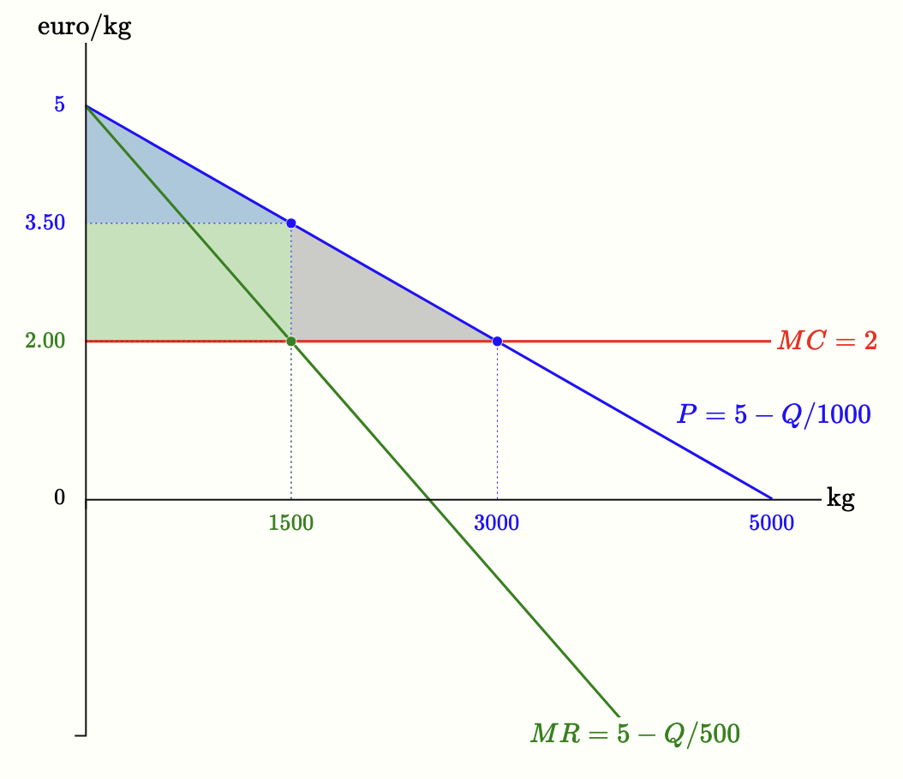

Siamo adesso in grado di calcolare la scelta ottima del monopolista, cioè rispondere alla prima domanda posta nella sezione precedente: quanto produrre, o, equivalentemente, che prezzo scegliere?

Come per ogni altra impresa, la scelta ottima del monopolista è determinata dall'uguaglianza tra ricavo marginale e costo marginale. La figura seguente illustra il calcolo della scelta ottima nell'esempio visto in precedenza: curva di domanda $P=5-Q/1000$ e costo marginale $MC=2$.



In generale, assumendo che la curva di domanda abbia la forma lineare $P = a - bQ$, e indicando con $c$ il valore del costo marginale del monopolista (nell'esempio visto prima, $c=2$), la condizione di massimizzazione del profitto $MR = MC$ è quindi $a - 2bQ = c$, da cui si ricava la scelta ottima del monopolista:

\(\begin{gathered}
Q = \frac{a - c}{2b}
\end{gathered}\)

Sostituendo questa quantità nella curva di domanda otteniamo il prezzo di monopolio:

\(\begin{gathered}
P = \frac{a + c}{2}
\end{gathered}\)

 

<h2 id="subsec_monopoly-dwl">Confronto con la concorrenza perfetta</h2>

Il prezzo fissato dal monopolista è superiore al costo marginale, a differenza di quanto accade in concorrenza perfetta, dove invece nel lungo periodo si ha

\(\begin{gathered}
P = c \quad \text{e} \quad Q = \frac{a - c}{b} 
\end{gathered}\)

Rispetto

al caso di concorrenza perfetta, il monopolista produce dunque una quantità minore (la metà) e applica un prezzo maggiore. Ciò implica che il surplus totale non è massimo — si ha una <i>perdita secca di monopolio</i>, rappresentata dal triangolo grigio nella Figura 5.5 (riproposta qui a lato). Nell'esempio di quella figura, il monopolista produce $1500$ unità e applica un prezzo di $3.50$ euro. Se aumentasse la produzione, dovrebbe ridurre il prezzo anche sulle unità già vendute, e il profitto (area verde) diminuirebbe. Per questo motivo, la quantità prodotta è più bassa di quella socialmente efficiente — la quantità concorrenziale, che è pari a $3000$ unità. 

Nell’introduzione abbiamo visto una prima illustrazione del principio secondo cui, ogni volta che in un mercato il surplus totale non è massimo, è possibile immaginare un’allocazione alternativa unanimemente preferita. Ciò è esattamente quanto accade qui. Come è possibile fare in modo che <i>tutti</i>, monopolista e consumatori, stiano meglio? Se la produzione salisse da $1500$ a $3000$ unità e il prezzo scendesse da $3.50$ a $2.00$ euro, il surplus dei consumatori crescerebbe dell’area verde più l’area grigia ($3375$ euro), mentre il monopolista perderebbe l’area verde ($2250$). Ma ciò vuol dire che i consumatori sono disposti a “comprare” dal monopolista questo cambiamento, ad un prezzo superiore alla somma a cui il monopolista è disposto a "venderlo". Offrendo al monopolista una somma compresa tra $2250$ e $3375$, il monopolista incasserebbe più di quanto perde e i consumatori otterrebbero un guadagno netto.

In pratica, i consumatori non dispongono di un'organizzazione collettiva. Esistono associazioni a tutela dei consumatori come <a href="https://www.altroconsumo.it" target="_blank">Altroconsumo</a> in Italia o <a href="https://www.beuc.eu" target="_blank">BEUC</a> a livello europeo, ma non possono organizzare trasferimenti collettivi di questa scala.

L’inefficienza non nasce quindi da un errore del monopolista, che massimizza razionalmente il proprio profitto, ma dal fatto che un accordo del genere non può realizzarsi. Coordinare milioni di consumatori in modo che si siedano tutti allo stesso tavolo e versino ciascuno la propria quota è semplicemente impossibile. È proprio questa mancanza di coordinamento dal lato della domanda che rende impraticabile l’accordo e lascia intatta la perdita secca di benessere.

 

<h2 id="subsec_monopoly-markup">Markup del monopolista</h2>

Una delle implicazioni più importanti del comportamento del monopolista riguarda il **markup** o **indice di Lerner**, ovvero la differenza tra prezzo e costo marginale, in rapporto al prezzo:

\(\begin{gathered}
\frac{P - MC}{P}
\end{gathered}\)

È infatti facile vedere che il markup del monopolista è pari all'inverso (con segno negativo) dell’elasticità della domanda al prezzo:

\(\begin{gathered}
\frac{P - MC}{P} = -\frac{1}{E^D}
\end{gathered}\)

dove $E^D$ è l’elasticità della domanda in corrispondenza della scelta ottima. Infatti in corrispondenza di quest'ultima abbiamo $MR=MC$, e d'altra parte abbiamo visto che $MR=P(1+1/E^D)$. Da questi due fatti segue immediatamente il risultato. 

Da questa relazione seguono due proprietà. Primo, <i>il monopolista sceglie sempre un punto in cui la domanda è elastica</i>. Se così non fosse (cioè se fosse in un tratto inelastico), un aumento del prezzo farebbe crescere il ricavo totale e diminuire i costi, aumentando il profitto: non potrebbe quindi trattarsi di un ottimo. Infatti, dalla formula di Lerner segue che, se $MC > 0$, deve valere $ \| E^D \| > 1$.

Secondo,

L’indice di Lerner può essere usato per misurare il potere di mercato di un’impresa, anche senza conoscere i suoi costi. Se si può stimare empiricamente l’elasticità della domanda al prezzo, è possibile inferire il grado di markup praticato.

<i>il markup è tanto più alto (e quindi il prezzo è tanto più alto) quanto più la domanda è rigida nel punto di ottimo</i>. In altre parole, se l’elasticità in valore assoluto è bassa, il rapporto $(P-MC)/P$ è grande e il monopolista può imporre un prezzo relativamente alto; viceversa, con un’elasticità elevata, il markup è piccolo e il prezzo rimane vicino al costo marginale. Questo spiega perché nei mercati in cui i consumatori hanno poche alternative o non possono facilmente rinunciare all’acquisto i prezzi tendano a essere elevati, mentre in mercati con prodotti sostituti molto simili la pressione concorrenziale mantiene i prezzi più bassi.

 

