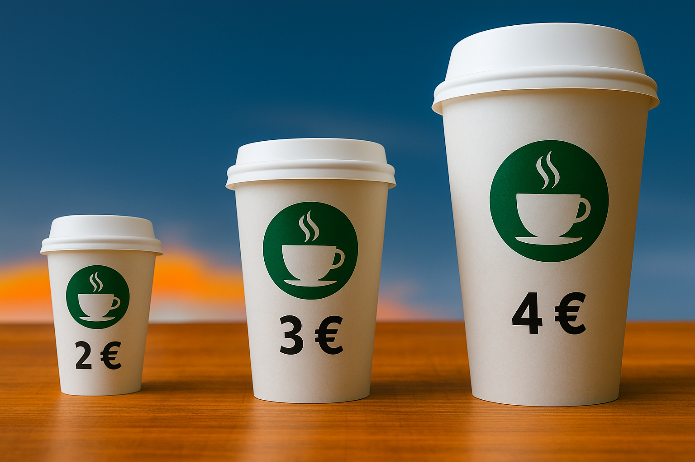

Nel modello di monopolio esaminato finora in questo capitolo, il prezzo applicato dal monopolista è <i>lineare</i> e <i>uguale per tutti</i>: ogni unità del bene è venduta allo stesso prezzo, indipendentemente dal numero di unità acquistate e da chi è l'acquirente. In questa sezione estendiamo l’analisi assumendo che il monopolista possa applicare prezzi differenti per lo stesso bene, in funzione della quantità acquistata o delle caratteristiche del consumatore. Come vedremo, questa pratica, nota come <b>discriminazione di prezzo</b>, consente al monopolista di catturare una quota maggiore del surplus generato dallo scambio.

Gli economisti distinguono

Questa classificazione fu introdotta dall'economista Arthur Cecil Pigou nel 1920 in <a href="https://oll-resources.s3.us-east-2.amazonaws.com/oll3/store/titles/1410/Pigou_0316_EBk_v6.0.pdf" target="_blank">The Economics of Welfare</a>. Nella versione originale il secondo grado non era esattamente un prezzo non lineare, ma piuttosto un'approssimazione alla discriminazione di primo grado ottenuta applicando un numero limitato di possibili prezzi unitari.

tradizionalmente tre forme di discriminazione:
<ul>
  <li>
    

  La discriminazione di <b>primo grado</b> o <b>perfetta</b> si ha quando il monopolista riesce ad applicare un prezzo diverso per ogni unità venduta — un prezzo pari alla massima disponibilità a pagare dei consumatori per quella unità — in modo tale da catturare l’<i>intero</i> surplus totale.
  

  </li>
  <li>
    

  La discriminazione di <b>secondo grado</b> o <b>prezzo non lineare</b> si ha quando il prezzo unitario è uguale per tutti, ma varia in funzione della quantità acquistata. Il caso più comune è lo sconto di quantità: un abbonamento annuale in palestra costa meno di dodici abbonamenti mensili, nei pacchetti di dati mobili il prezzo per GB scende passando da "100" a "200" a “illimitato”, ecc.

  </li>
  <li>
    

  La discriminazione di <b>terzo grado</b> o <b>basata su caratteristiche osservabili</b> consiste nell’applicare prezzi lineari diversi a gruppi distinti di consumatori, identificabili in base a caratteristiche osservabili (come per esempio età o luogo di residenza). Esempi classici sono le tariffe riservate a giovani e studenti per viaggi (per es. FrecciaYoung) o software e servizi digitali (per es. Spotify Premium o Amazon Prime).

  </li>
</ul>

 

<h2 id="subsec_discrimination-perfect">Discriminazione di prezzo perfetta</h2>

Quando il monopolista applica prezzi lineari e uguali per tutti, ciascuna unità è venduta allo stesso prezzo: ogni consumatore acquista un'unità in più solo se la sua disponibilità a pagare per quell'unità è almeno pari a quel prezzo. Il monopolista potrebbe attrarre nuovi clienti e vendere di più a chi già lo è, ma per farlo dovrebbe abbassare il prezzo, riducendo il ricavo sulle unità che già vendeva: è il meccanismo dell'<i>effetto prezzo</i> di cui abbiamo parlato <a href="{{ site.baseurl }}/it/II/5/1#mon-price-effect">in precedenza</a>. Il monopolista preferisce mantenere un prezzo più alto, rinunciando così a vendere ulteriori unità che i consumatori sarebbero disposti a pagare più del costo marginale.

Con la discriminazione perfetta, il monopolista riesce a superare completamente questo vincolo: vende ogni unità ad un prezzo pari alla massima disponibilità a pagare per quell'unità — il prezzo più alto che qualche consumatore è disposto a pagare per averla, senza dover abbassare il prezzo delle unità precedenti. Ma se l'effetto prezzo è nullo, <i>la funzione di ricavo marginale coincide con la curva di domanda di mercato</i>. L’impresa si appropria dell’intero surplus, e ha quindi incentivo a massimizzarlo: la quantità scambiata è quella concorrenziale, e la perdita secca è zero.

La figura seguente mostra questo risultato, assumendo per semplicità che esistano solo due consumatori e, per chiarezza, che il bene sia non divisibile, come ad esempio i biglietti della metropolitana.

<a id="gr_monopoly_mon-disc1"><b>FIGURA 5.6</b></a>


Nel caso di un bene divisibile, il ragionamento è lo stesso: ogni piccola frazione viene venduta al prezzo corrispondente alla disponibilità a pagare, indicata dalla curva di domanda. La figura seguente illustra il caso di un operatore telefonico che vende gigabyte di dati mobili. Ipotizziamo che il costo marginale del monopolista sia $MC=2$ e che la domanda di mercato sia $P = 10 - Q/50$, dove $P$ indica il prezzo per gigabyte e $Q$ la quantità di (milioni di) gigabytes.



<h3 id="subsec_discrimination-twopart">Tariffe a due parti e vendite a pacchetto</h3>

La discriminazione di prezzo perfetta può sembrare difficilmente realizzabile in pratica, e infatti lo è. Una possibile perplessità nasce dal fatto che, per attuarla, sembrerebbe che il monopolista debba far pagare un prezzo diverso a seconda di quante unità un consumatore ha <i>già</i> acquistato. Nella Figura 5.6, per esempio, Alice paga un biglietto 9 euro se non ne ha già acquistati, 7 se ne ha già acquistato uno, e così via. Tuttavia, questo non è il vero motivo per cui la discriminazione perfetta è difficile da realizzare (i veri motivi li discuteremo più giù). Esistono infatti due strategie, entrambe piuttosto comuni nella realtà, che replicano l’esito della discriminazione perfetta: la tariffa a due parti e la vendita a pacchetto.

Una <b>tariffa a due parti</b> prevede due componenti:
<ul>
  <li>una <i>quota fissa di accesso</i>, pagata <i>una tantum</i> dal consumatore per poter usufruire del bene o servizio;</li>
  <li>un <i>prezzo unitario</i>, da pagare per ogni unità acquistata.</li>
</ul>
La tariffa a due parti che massimizza il profitto del monopolista si basa su un’idea molto semplice: scegliere il prezzo unitario in modo da indurre il consumatore ad acquistare tutte le unità che creano surplus, e la parte fissa in modo da catturare interamente quel surplus. Per farlo, il monopolista fissa il prezzo unitario al livello del costo marginale, così che il consumatore sia incentivato ad acquistare tutte le unità per cui la disponibilità a pagare è superiore al costo. A quel punto, sceglie una quota fissa pari al beneficio netto che il consumatore otterrebbe pagando solo il prezzo unitario. Il consumatore è disposto a pagare quella quota fissa, perché ottiene la quantità che desidera a un prezzo complessivo ancora conveniente; ma alla fine il suo surplus è azzerato, e tutto il valore generato dallo scambio va all’impresa.

Riprendiamo l'esempio della Figura 5.6, in cui ogni unità rappresenta un biglietto della metropolitana. Alice è disposta a pagare 9 euro per il primo biglietto, 7 per il secondo, e così via. Bruno è disposto a pagare 6 euro per il primo biglietto, 4 per il secondo, e così via. Se il prezzo unitario è fissato al costo marginale ($1.50$ euro), Alice acquista quindi 4 biglietti, mentre Bruno ne acquista 3. Il surplus che Alice riceverebbe pagando solo il prezzo unitario è

Il ragionamento resta identico se “Alice” e “Bruno” non sono singoli consumatori ma, più realisticamente, <i>gruppi</i> omogenei di consumatori, composti da molti individui con la stessa domanda individuale. Il monopolista chiede una parte fissa di 18 euro a ciascun consumatore di "tipo Alice", una di 7.50 euro a ciascun consumatore di "tipo Bruno", e 1.50 euro/biglietto a tutti. Quantità, ricavi e profitti sono moltiplicati per le numerosità dei due gruppi, senza cambiare la logica né i risultati mostrati nel testo.

\(\begin{gathered} (9 - 1.50) + (7 - 1.50) + \dots + (3 - 1.50) = 18 \end{gathered}\)

Analogamente, il surplus che Bruno riceverebbe è

\(\begin{gathered} (6 - 1.50) + (4 - 1.50) + (2 - 1.50) = 7.50 \end{gathered}\)

Il monopolista può quindi chiedere una quota d’accesso di 18 euro ad Alice, e una di 7.50 a Bruno, oltre al pagamento di 1.50 euro per ciascun biglietto. Il profitto totale sarà $18+7.50=25.50$ euro, come nella discriminazione perfetta.

Consideriamo ora l’esempio della Figura 5.7, dove il bene consiste in dati mobili. In quell'esempio il costo marginale è $MC=2$ e la domanda di mercato è $Q = 500 - 50P$. Possiamo pensare a quest'ultima come la domanda aggregata di 100 consumatori identici, ciascuno con domanda individuale $Q = 5 - P/2$. Se il prezzo unitario è fissato a 2 euro, ciascun consumatore acquista $4$ gigabytes, ottenendo un surplus pari a 16 euro. Il

Tariffe a due parti e vendite a pacchetto sono ampiamente utilizzate. Gli operatori telefonici (come nella Figura 5.7) offrono tariffe a due parti sotto forma di abbonamenti con canone fisso mensile e costo per GB o minuto, oppure pacchetti prepagati che includono una quantità fissa di dati e minuti a prezzo unico. I trasporti pubblici (come nella Figura 5.6) spesso offrono sia carnet prepagati per es. da 10 corse (vendita a pacchetto), sia abbonamenti con quota fissa e prezzo unitario per tratte aggiuntive (tariffa a due parti). Nei servizi di car sharing si trovano formule analoghe: da un lato, abbonamenti mensili più un prezzo per minuto o chilometro percorso; dall’altro, pacchetti orari o giornalieri a tariffa fissa.

monopolista può quindi proporre una tariffa con prezzo unitario pari a 2 euro e una quota fissa d’accesso di 16 euro. Il profitto complessivo è ancora una volta pari al massimo surplus totale, 1600 euro.

La <b>vendita a pacchetto</b> consiste nel proporre al consumatore un blocco di unità a un prezzo fisso complessivo. Il consumatore può scegliere se acquistare l’intero pacchetto oppure nulla, ma non può acquistare quantità intermedie.

Tornando all’esempio dei biglietti della metropolitana (Figura 5.6), sappiamo che Alice è disposta a pagare in totale 24 euro per 4 biglietti, e Bruno è disposto a pagare 12 euro per 3 biglietti. Il monopolista può semplicemente offrire ad Alice un pacchetto da 4 biglietti al prezzo di 24 euro, e a Bruno un pacchetto da 3 biglietti al prezzo di 12 euro. Il ricavo del monopolista è 36 euro, il costo $7 \times 1.50 = 10.50$ euro, quindi il profitto è 25.50 euro: lo stesso risultato della tariffa a due parti.

Nel caso dei dati mobili (Figura 5.7), il consumatore acquisterebbe 4 gigabytes al prezzo di 2 euro/GB, e il valore totale che attribuisce ad un pacchetto da 4 GB è pari a 24 euro. Il monopolista può quindi vendere un pacchetto da 4 GB a 24 euro. Il costo è 8 euro, il profitto è 16 euro per ogni consumatore, ovvero 1600 in totale: ancora una volta, lo stesso ottenuto con la tariffa a due parti.

 

<h3 id="subsec_discrimination-difficulties">Difficoltà informative e istituzionali/economiche</h3>

La discriminazione di prezzo perfetta è un utile benchmark teorico: rappresenta il caso limite in cui il monopolista può estrarre tutto il surplus offrendo tariffe nonlineari (per esempio tariffe a due parti o pacchetti) personalizzate. Tuttavia, è difficile da mettere in pratica. Il monopolista deve fare i conti con (almeno) due sfide importanti:

Tessere fedeltà, app e registrazioni online servono anche a raccogliere dati sulle abitudini di acquisto, così da stimare meglio la domanda dei diversi segmenti di clientela. Alcune imprese vanno oltre, utilizzando la <i>profilazione digitale</i> per costruire offerte personalizzate.

<ul>
  <li>Le domande individuali, soprattutto quando i consumatori sono molto eterogenei, sono raramente osservabili in dettaglio.</li>
  <li>Tariffe nonlineari potrebbero essere vietate (ciò accade per esempio con alcune <i>utilities</i>) o del tutto inutili (per esempio quando ciascun consumatore acquista al massimo una sola unità).</li>
</ul>

Quando i consumatori sono identici (come possiamo pensare sia il caso nell'esempio in Figura 5.7, o se in quello della Figura 5.6 Bruno non esistesse e i consumatori fossero tanti "Alice"), la prima sfida non rappresenta un grosso problema. Se non è vietato né inutile offrire tariffe nonlineari, il monopolista può attuare discriminazione perfetta offrendo una singola tariffa a due parti o un singolo pacchetto. D'altra parte, se le tariffe nonlineari sono inapplicabili, il discorso ugualmente finisce qui: il meglio che il monopolista può fare è offrire un prezzo lineare uguale per tutti, come nell'analisi di base delle sezioni precedenti.

Nella realtà, tuttavia, gli individui sono eterogenei. Questo rende potenzialmente rilevanti entrambe le sfide e, di conseguenza, la discriminazione di secondo grado (per il problema informativo) e quella di terzo grado (quando la non linearità è vietata o inutile). Come vedremo, questi due tipi di discriminazione sono le migliori strategie disponibili per rispondere, rispettivamente, alle due sfide. Il monopolista non riuscirà a replicare la discriminazione perfetta, ma otterrà comunque un profitto maggiore rispetto al caso di un prezzo lineare uguale per tutti.

 

<h2 id="subsec_discrimination-second">**Discriminazione di secondo grado</h2>

Supponiamo che il monopolista possa offrire tariffe nonlineari ma non possa trattare diversamente i consumatori perché non sa dire "chi è chi". In questo caso, la cosa migliore da fare è offrire un <i>menù</i> di opzioni e lasciare che ciascuno si <i>autoselezioni</i> scegliendo l'opzione preferita. L'analisi di questo tipo di discriminazione è, in generale, abbastanza complicata, e richiede strumenti di <i>economia dell'informazione</i> che non abbiamo. Ci limiteremo quindi ad un caso semplice, che riprende i dati dell'esempio illustrato nella Figura 5.6.

Abbiamo dunque Alice, che è disposta a pagare 9 euro per il primo biglietto, 7 per il secondo, e così via, e Bruno, che è disposto a pagare 4 euro per il primo biglietto, 3 per il secondo, e così via. Nella Figura 5.6 abbiamo visto che, applicando un prezzo lineare uguale per tutti, il massimo profitto che il monopolista può ottenere è 14 euro, mentre se può discriminare perfettamente, il massimo profitto è 25.50 euro. Quanto profitto può ottenere se può offrire tariffe nonlineari, ma non sa distinguere Alice da Bruno?

Una possibilità è offrire un pacchetto da 4 biglietti a 24 euro e uno da 3 biglietti a 12 euro, come nella discriminazione perfetta. Ma questa non è una buona idea. Così facendo, il monopolista indurrebbe non solo Bruno, ma <i>anche Alice</i> a scegliere il pacchetto da 3 biglietti. Infatti Alice preferisce pagare 12 euro per 3 biglietti, che per lei valgono $9+7+5=21$ euro, a pagarne 24 per 4. Nel primo caso il suo surplus è $21-12=9$, nel secondo è zero. Il profitto del monopolista sarebbe quindi molto basso: $12+12-2\times(3+3)=12$. Per fare in modo che Alice compri il pacchetto da 4, che per Alice vale $9+7+5+3=24$ euro, questo dovrebbe costare 15 euro. Il profitto del monopolista sarebbe allora $12+15-2\times(3+4)=13$. Ma il monopolista può fare molto meglio di così.

Per fare più profitto, il monopolista deve ridurre l’attrattiva del pacchetto pensato per Bruno, in modo da poter alzare il prezzo del pacchetto pensato per Alice. Il procedimento per trovare la strategia giusta è semplice. A partire dai due pacchetti offerti con discriminazione perfetta (3 biglietti a 12 euro, 4 biglietti a 24 euro), si riducono progressivamente quantità e prezzo del pacchetto pensato per Bruno, e contemporaneamente si fissa il prezzo per il pacchetto pensato per Alice in modo da farglielo scegliere, fino a individuare la combinazione che assicura il profitto maggiore. Illustriamo ora il procedimento.

Supponiamo di offrire un pacchetto da 2, anziché 3 biglietti, a 10 euro (quanto Bruno è disposto a pagare per due biglietti). Questa opzione adesso è meno allettante per Alice: se la scegliesse, otterrebbe un surplus pari al suo valore di due biglietti ($9+7=16$) meno $10$, cioè $6$. Per fare in modo che Alice compri il pacchetto da 4 biglietti, possiamo allora fissare il prezzo di quel pacchetto in modo che ad Alice resti almeno un surplus di $6$. Il valore dei 4 biglietti per Alice è 24, quindi possiamo vendere il pacchetto da 4 biglietti a $18$ euro. A questo punto Alice sceglie “4 biglietti a 18 euro” e Bruno sceglie “2 biglietti a 10 euro”. Il ricavo è $18+10=28$ mente i costi sono $1.50\times(3+4)=10.50$. Il profitto è $28−10.50 = 17.50$.

Continuando il procedimento, supponiamo di offrire un pacchetto da 1 biglietto a 6 euro (quanto Bruno è disposto a pagare per un biglietto). Questa opzione è ancora meno allettante per Alice: scegliendola,  otterrebbe un surplus di $9-6=3$. Per fare in modo che Alice compri il pacchetto da 4 biglietti possiamo allora fissarne il prezzo a $24-3=21$ euro. A questo punto Alice sceglie “4 biglietti a 21 euro”, Bruno sceglie “1 biglietto a 6 euro”. Il ricavo è $21+6=27$ e i costi sono $1.50\times 5=7.50$, il profitto è $27−7.50 = 19.50$.

È possibile fare un profitto ancora maggiore riducendo ulteriormente la quantità pensata per Bruno? Ciò vorrebbe dire ridurla a zero, cioè offrire solo un pacchetto da 4 biglietti pensato per Alice. Non avendo opzioni alternative da cui distogliere Alice, il monopolista potrebbe fissare il prezzo del pacchetto al massimo che Alice è disposta a pagare, 24 euro. Ma il profitto sarebbe più basso: $24-1.50\times 4=18$. La strategia migliore è quindi quella descritta nello step precedente del procedimento: biglietti singoli a 6 euro l'uno, e pacchetti da 4 biglietti a 21 euro. Il monopolista applica uno <b>sconto di quantità</b>. Vende biglietti singoli a 6 euro, e pacchetti da 4 biglietti a 5.25 euro a biglietto.

Gli sconti

di quantità come quello appena visto, e come i “3×2”, “il meno caro a metà prezzo” ecc. che osserviamo spesso nei mercati reali, sono classici prezzi non lineari. Il venditore applica un prezzo unitario decrescente all’aumentare della quantità, spingendo i clienti con disponibilità a pagare maggiori a comprare di più. Altri esempi sono i piani a scaglioni (mobile, cloud), le versioni base/premium, gli "sconti da ritagliare" e le soglie per avere spedizione gratuita negli acquisti online. In tutti questi casi l’impresa, non potendo distinguere i diversi tipi di consumatore, offre un menù che rende ottimale per ciascun cliente scegliere l’opzione “pensata per lui”, permettendo di estrarre più surplus rispetto al prezzo lineare unico.

 

<h2 id="subsec_discrimination-observable">Discriminazione basata su caratteristiche osservabili</h2>

Supponiamo ora che l'informazione non sia un problema (il monopolista sa "chi è chi" e può trattare i consumatori in modo diverso) ma che non possa (o sia inutile) applicare prezzi nonlineari. La cosa migliore da fare in questo caso è offrire prezzi lineari personalizzati. Come vedremo, anche qui il monopolista dovrà rinunciare a parte del surplus — stavolta a causa del vincolo di linearità dei prezzi — ma otterrà un profitto comunque superiore rispetto al caso di prezzo lineare uguale per tutti.

Per capire come funziona la <b>discriminazione basata su caratteristiche osservabili</b>, prendiamo l’esempio delle licenze di una suite Office. Poiché quasi tutti gli utenti acquistano una sola licenza, è naturale pensare a prezzi lineari: sconti di quantità o altre forme di prezzo non lineare non aumenterebbero i profitti. È plausibile inoltre che professionisti e aziende abbiano una disponibilità a pagare più elevata rispetto, per esempio, agli studenti, e che il monopolista sia in grado di distinguere i due segmenti (ad esempio tramite la verifica dello status di studente) applicando prezzi differenti. 

Supponiamo allora che esistano due gruppi di utenti: i professionisti/aziende (gruppo A), con disponibilità a pagare più alta, e gli studenti (gruppo B), con disponibilità più bassa. La figura seguente, in cui per semplicità — e per facilitare il confronto con la discriminazione perfetta — utilizziamo gli stessi numeri già visti nella <a href="{{ site.baseurl }}/it/II/5/3#gr_monopoly_mon-disc1">Figura 5.6</a>, mostra come il monopolista possa aumentare i propri profitti applicando un prezzo più alto ai professionisti e un prezzo più basso agli studenti.

<a id="gr_monopoly_mon-disc-oss1"><b>FIGURA 5.8</b></a>


Consideriamo ora un bene divisibile, per esempio

Sconti e tariffe agevolate per giovani e studenti sono molto diffusi nei trasporti ferroviari in Europa e in molti altri Paesi, dove età o status di studente danno accesso a prezzi ridotti.

i chilometri di viaggio su una tratta ferroviaria (misurati in blocchi di 100 km). Supponiamo che la popolazione sia costituita da due gruppi di utenti: gli adulti, la cui curva di domanda aggregata è $Q_A=20-P$, e i giovani, con curva di domanda $Q_B=12-P$, dove $Q_A$ e $Q_B$ denotano i milioni di centinaia di km domandati ad ogni dato prezzo.
Il costo marginale è $MC=2$ euro / 100km. Se il monopolista applica un prezzo unico, dovrà scegliere un compromesso che non massimizza il profitto in nessuno dei due gruppi. Se invece segmenta il mercato offrendo un prezzo più basso agli studenti e più alto agli altri, ottiene un profitto maggiore. La figura seguente illustra il risultato.

  

<a id="gr_monopoly_mon-disc-oss2"><b>FIGURA 5.9</b></a>


Nella <a href="{{ site.baseurl }}/it/II/5/2#subsec_monopoly-markup">sezione precedente</a> abbiamo visto che il prezzo lineare applicato da un monopolista che non discrimina è tanto più alto quanto più rigida è la domanda nel punto di ottimo. Lo stesso ragionamento si applica alla discriminazione di terzo grado: la regola di Lerner vale separatamente per ciascun gruppo. In ogni

Se invece il monopolista non discrimina, sceglie $P=9$, ma questo prezzo intermedio non massimizza i profitti in nessuno dei due gruppi. Infatti in corrispondenza di $P=9$ si ha
$$
 -\frac{1}{E^D_A} > \frac{P - MC}{P} > -\frac{1}{E^D_B}
$$
La prima disuguaglianza dice che $MR_A< MC$, la seconda che $MR_B> MC$. In altre parole, a partire da $P=9$ il monopolista ha incentivo a ridurre la quantità (aumentare il prezzo) per il gruppo $A$ e ad aumentare la quantità (ridurre il prezzo) per il gruppo $B$.

segmento di mercato il monopolista sceglie i prezzi ottimali $P_A=11$ e $P_B=7$ imponendo le condizioni

\(\begin{gathered}
 \frac{P_A - MC}{P_A} = -\frac{1}{E^D_A}
 \qquad
 \frac{P_B - MC}{P_B} = -\frac{1}{E^D_B}
\end{gathered}\) 

dove $E^D_A$ e $E^D_B$ sono le elasticità della domanda nei due gruppi. Nel nostro esempio, la domanda degli adulti è meno elastica a parità di prezzo, e il monopolista applica quindi un prezzo più alto a questo gruppo. Al contrario, la domanda dei giovani è più elastica, e il prezzo ottimale risulta più basso. Questa logica spiega perché, nei mercati reali, osserviamo regolarmente tariffe ridotte per studenti o altre categorie con maggiore sensibilità al prezzo: non si tratta di sconti “altruistici”, ma di una strategia di massimizzazione del profitto basata sulla diversa elasticità della domanda.

