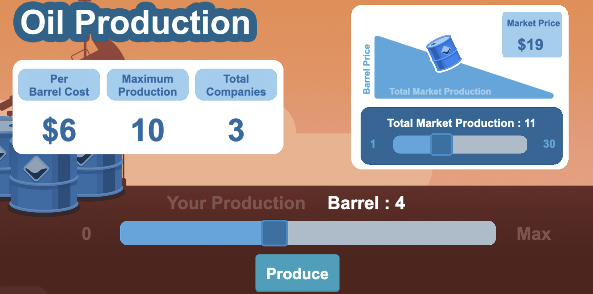

In un’<a href="https://www.gamberorosso.it/notizie/vino/vendemmia-2025-vietato-produrre-troppo-monito-uiv/" target="_blank">intervista</a> rilasciata

nel 2025, il presidente dell’Unione Italiana Vini lanciava un appello accorato ai produttori del settore:

<blockquote>
  
«Non possiamo più permetterci vendemmie da 50 milioni di ettolitri… Non è producendo di più che si guadagna di più. La conseguenza? Un abbassamento del valore, con un prezzo medio della produzione in ribasso in doppia cifra.»

</blockquote>

Il ragionamento è chiaro: se ogni produttore decide di aumentare la propria produzione, il prezzo di mercato del vino — che si formerà solo mesi dopo, al momento della vendita — rischia di scendere per tutti, riducendo i margini di profitto. Al tempo stesso, l’appello a “non produrre troppo” implica il desiderio che anche gli altri produttori si comportino in modo simile, contenendo l’offerta complessiva per sostenere i prezzi.

Questa situazione concreta illustra bene tre aspetti fondamentali dell’interazione strategica tra le imprese in molti mercati. Primo, in contesti in cui la produzione richiede tempo o non può essere facilmente modificata, la quantità viene scelta in anticipo ed è quindi la variabile strategica, decisa prima che il prezzo si formi. Secondo, ogni impresa è consapevole che le proprie scelte influenzano il prezzo di mercato: c’è interdipendenza strategica. Terzo, esiste una tensione tra interesse individuale e interesse collettivo: la concorrenza porta a una produzione maggiore (e quindi ad un profitto complessivo minore) rispetto al monopolio.

Nel capitolo

Nel 1838 Antoine Augustin Cournot fu il primo a descrivere matematicamente il duopolio come concorrenza sulle quantità. Nello stesso lavoro introdusse anche la prima analisi matematica del monopolio, il modello esaminato nelle prime due sezioni del <a href="{{ site.baseurl }}/it/II/5">Capitolo 5</a>.

precedente abbiamo esaminato questo tipo di interazione strategica attraverso un modello semplificato di duopolio, in cui ciascuna impresa poteva scegliere solo tra pochi livelli produttivi. In questa sezione introduciamo il <strong>duopolio di Cournot</strong>, che estende quell’analisi consentendo a ciascuna impresa di scegliere qualsiasi quantità non negativa. Le imprese decidono simultaneamente le quantità da immettere sul mercato, e il prezzo si forma successivamente, in modo da uguagliare l'offerta complessiva alla domanda. Il modello descrive mercati in cui le imprese oligopolistiche devono decidere le proprie quantità prima che il prezzo si formi, ad esempio perché la produzione comporta tempi lunghi.
Un esempio classico è quello del mercato del petrolio greggio, in cui i grandi produttori (come i paesi membri dell’OPEC)

Nel caso del vino, l'aderenza del modello alla realtà è più limitata, dato che il mercato è frammentato in molti piccoli produttori.

decidono in anticipo quanto estrarre e raffinare, sapendo che il prezzo si determinerà solo in seguito, in base a offerta aggregata e domanda mondiale.

Prima di analizzare il modello di Cournot vero e proprio, consideriamo ancora una versione semplificata, stavolta ipotizzando un insieme più ricco di strategie per ciascuna impresa. Questo ci aiuterà a capire meglio l'equilibrio nel gioco più generale in cui qualsiasi quantità non negativa è ammessa.

<!-- 9x9 discrete Cournot duopoly -->


Immaginando che la matrice di gioco rappresentata qui sopra sia un piano cartesiano, possiamo pensare ai possibili profili di strategie (celle della matrice) come punti del piano, e alle strategie delle imprese 1 e 2 come le corrispondenti coordinate verticale e orizzontale. Questo è esattamente il modo in cui rappresentiamo il duopolio di Cournot. L'impresa 1 sceglie una quantità (un punto sull'asse verticale), l'impresa 2 ne sceglie un'altra (un punto sull'asse orizzontale), e la domanda di mercato determina il prezzo e quindi i corrispondenti payoff (profitti).

La figura seguente illustra il calcolo delle risposte ottime e dell'equilibrio di Cournot-Nash. Nel grafico è possibile manipolare i parametri della curva di domanda, che assumiamo abbia la forma lineare $P=a-bQ$, dove $Q = Q_1 + Q_2$ è la somma delle quantità prodotte dalle due imprese, e i costi marginali siano costanti e uguali per le due imprese: $MC_1=MC_2=c$.



Come è naturale aspettarsi, la quantità di equilibrio aumenta se la domanda è più alta — cioè se $a$ aumenta o $b$ diminuisce — o se il costo marginale $c$ diminuisce. Ricordando che $c=AC_\text{min}$ poiché ciascuna impresa opera alla scala efficiente di produzione nelle sue unità produttive, una riduzione di $c$ può riflettere un miglioramento tecnologico, oppure una diminuzione dei costi fissi o dei salari. L'equilibrio è <i>simmetrico</i>: le imprese producono la stessa quantità. Ciò dipende dal fatto che abbiamo ipotizzato che abbiano hanno lo stesso costo marginale. È facile vedere, ripetendo il calcolo delle risposte ottime, che se invece i costi marginali fossero diversi, in equilibrio l’impresa con il costo minore produrrebbe una quantità maggiore.

 

<h2 id="subsec_mkt-comparison">Confronto tra strutture di mercato</h2>

Il modello di Cournot permette di confrontare in modo chiaro gli esiti di equilibrio in diverse strutture di mercato. Con domanda lineare $P=a-bQ$ e costo marginale costante $MC=AC_\text{min}=c$, abbiamo visto nel <a href="{{ site.baseurl }}/it/II/5/">Capitolo 5</a> che il monopolista sceglie una quantità pari alla metà di quella che si avrebbe in concorrenza perfetta. In questa stessa sezione abbiamo trovato che, con due imprese in concorrenza alla Cournot, la quantità complessiva prodotta è pari a due terzi di quella concorrenziale. Più in generale, si può facilmente dimostrare che con $n$ imprese che competono alla Cournot, la quantità totale di equilibrio è pari a una frazione $n/(n+1)$ della quantità concorrenziale — al crescere del numero di imprese, il mercato si avvicina gradualmente all’esito competitivo. La tabella seguente riassume questi risultati.

 

<table class="alf"> <thead> <tr> <th>Struttura di mercato</th> <th>Quantità totale</th> <th>Prezzo di mercato</th> </tr> </thead> <tbody> <tr> <td>Monopolio</td> <td>\( \dfrac{a - c}{2b} \)</td> <td>\( \dfrac{a + c}{2} \)</td> </tr> <tr> <td>Duopolio di Cournot</td> <td>\( \dfrac{2(a - c)}{3b} \)</td> <td>\( \dfrac{a + 2c}{3} \)</td> </tr> <tr> <td>Cournot con $n$ imprese</td> <td>\( \dfrac{n(a - c)}{(n + 1)b} \)</td> <td>\( \dfrac{a + nc}{n + 1} \)</td> </tr> <tr> <td>Concorrenza perfetta</td> <td>\( \dfrac{a - c}{b} \)</td> <td>\( c \)</td> </tr> </tbody> </table>

 

La tabella mostra come l’esito di equilibrio dipende dalla struttura del mercato. All’aumentare del numero di imprese, la quantità totale si avvicina a quella della concorrenza perfetta, il prezzo si riduce verso il livello del costo marginale. Il susplus del produttore diminuisce, ma il surplus del consumatore cresce più rapidamente, così che il surplus totale aumenta. Anche in presenza di più imprese, il modello di Cournot rivela una tensione tra interesse individuale e collettivo: ciascuna impresa ha un incentivo a produrre di più per aumentare il proprio profitto, ma se tutte agiscono allo stesso modo, il prezzo si abbassa e i profitti si riducono per tutti. Il risultato è un esito intermedio, in cui la quantità prodotta è maggiore rispetto al monopolio ma inferiore rispetto alla concorrenza perfetta.

