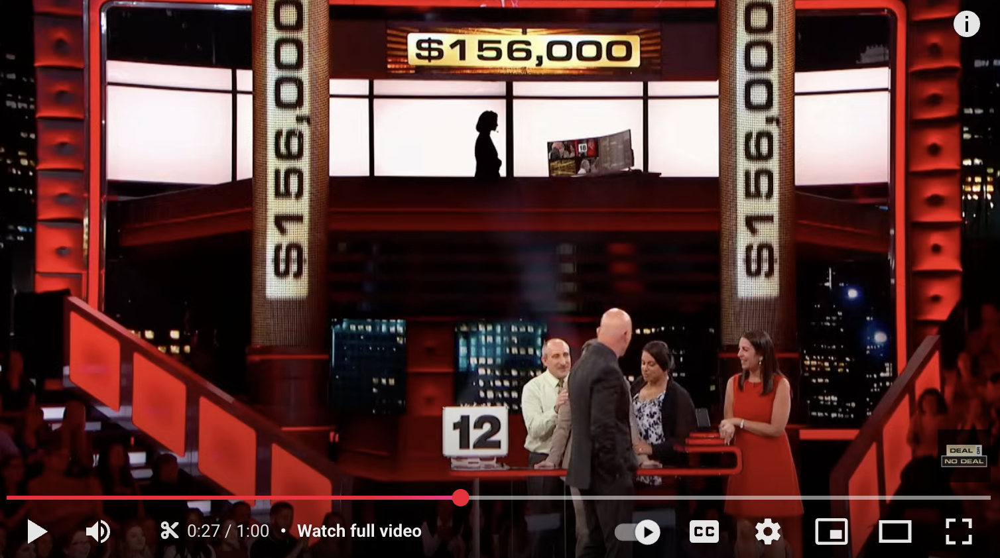

Molte decisioni economiche avvengono in condizioni di rischio: gli individui non conoscono con certezza le conseguenze future delle proprie azioni, ma possono soltanto stimarne le probabilità. Come può un individuo scegliere razionalmente senza certezze sull'esito della sua scelta? Per analizzare tali contesti, è necessario introdurre uno strumento nuovo: la teoria delle scelte in condizioni di incertezza, che cerca di rispondere a domande come:
<ul>
	<li>
	Assicurare o meno l’automobile contro il furto?
	</li>
	<li>Quanto investire in azioni rischiose e quanto in titoli sicuri?</li> <li>Accettare un contratto di lavoro in cui il salario dipende, oltre che dall’impegno individuale, anche da fattori esterni?
	</li>
</ul>

Tutte queste situazioni hanno in comune il fatto che l’individuo deve scegliere tra <i>alternative aleatorie</i>: opzioni che conducono a diversi esiti possibili, ciascuno con una certa probabilità.

<h2 id="subsec_lotteries">Lotterie</h2>

In microeconomia, rappresentiamo matematicamente tali alternative attraverso il concetto di <b>lotteria</b>, definita da:

<ul>
	<li>un insieme di esiti possibili (<em>payoff</em>), spesso rappresentati da somme di denaro;</li>
	<li>una distribuzione di probabilità  Le probabilità sono numeri compresi tra 0 e 1 e devono sommare esattamente a 1.  associata a tali esiti, che riflette quanto l’individuo ritiene verosimile ciascun risultato.
	</li>
</ul>

Presentiamo ora due esempi che mostrano come le scelte in condizioni di rischio possano essere rappresentate in modo preciso tramite lotterie.

<h3>Esempio 1 - Assicurazione</h3>
Consideriamo il proprietario di un’automobile del valore di $10000$ euro. Supponiamo che la probabilità che l'auto venga rubata sia del 2%, ovvero $0.02$,  Ad esempio, potrebbe risultare che, statisticamente, su cento auto simili, circa due vengano rubate ogni anno.  e che la probabilità che non venga rubata sia quindi del 98%, ovvero $0.98$. L'alternativa "non assicurarsi" è allora rappresentata dalla seguente lotteria:

<table border="1" cellpadding="5" style="width:20%; table-layout:auto;"> <tr> <th>Payoff (euro)</th> <th>Probabilità</th> </tr> <tr> <td align=center>0</td> <td align=center> 2/100</td> </tr> <tr> <td align=center>10.000</td> <td align=center>98/100</td> </tr> </table>

L'alternativa "acquistare una copertura totale del danno, pagando un premio di $500$ euro" corrisponde a una lotteria in cui si ottiene con certezza un payoff pari a $9500$ euro:

<table border="1" cellpadding="5" style="width:20%; table-layout:auto;"> <tr> <th>Payoff (euro)</th> <th>Probabilità</th> </tr> <tr> <td align=center>9.500</td> <td align=center>1</td> </tr> </table>

Altre alternative, come assicurare solo una parte del valore dell'auto o sottoscrivere una polizza con franchigia, possono anch’esse essere modellate come lotterie. Ad esempio, un'assicurazione parziale a copertura di metà del valore, acquistata al prezzo di $200$ euro, corrisponde alla seguente lotteria:

<table border="1" cellpadding="5" style="width:20%; table-layout:auto;"> <tr> <th>Payoff (euro)</th> <th>Probabilità</th> </tr> <tr> <td align=center>4.800</td> <td align=center>2/100</td> </tr> <tr> <td align=center>9.800</td> <td align=center>98/100</td> </tr> </table>

 

<h3>Esempio 2 - Investimento</h3>

Un piccolo imprenditore dispone di 1000 euro da investire nell’apertura di nuovi punti vendita. Può scegliere tra due località, $A$ e $B$, entrambe caratterizzate da un alto potenziale di guadagno ma anche da incertezza. Ogni punto vendita può avere due esiti: in caso di successo, il ritorno è pari a tre volte l'investimento; in caso di fallimento, l'investimento è completamente perso. La probabilità di successo è del 50% per ciascuna località, e gli esiti nelle due località sono indipendenti.

L’impresa sta valutando due strategie. La prima è aprire un punto vendita di grandi dimensioni in una sola località, per esempio $A$, investendo tutto in quella località. Questa scelta corrisponde alla seguente lotteria:
<table border="1" cellpadding="5" style="width:20%; table-layout:auto;"> <tr> <th>Payoff (euro)</th> <th>Probabilità</th> </tr> <tr> <td align=center>0</td> <td align=center>1/2</td> </tr> <tr> <td align=center>3000</td> <td align=center>1/2</td> </tr> </table>

La seconda strategia è suddividere l’investimento tra $A$ e $B$. L’impresa apre due punti vendita più piccoli, uno in ciascuna località, investendo $500$ euro per ciascun punto. I payoff possibili

Poiché gli esiti nei due punti vendita sono indipendenti, ciascuna delle quattro possibili (e mutuamente esclusive) combinazioni di successo e fallimento ha probabilità pari a $1/4$. Le due combinazioni "$A$ fallisce, $B$ ha successo" e "$B$ fallisce, $A$ ha successo" producono entrambe un payoff di $1500$. La probabilità che <i>una o l’altra</i> si verifichi è quindi $1/4 + 1/4 = 1/2$.

dipendono dalle combinazioni di esiti:

<table border="1" cellpadding="5" style="width:30%; table-layout:auto;"> <tr> <th>Evento</th> <th>Payoff (euro)</th> <th>Probabilità</th> </tr> <tr> <td align=center>Entrambi falliscono</td> <td align=center>0</td> <td align=center>1/4</td> </tr> <tr> <td align=center>Uno ha successo, l'altro no</td> <td align=center>1500</td> <td align=center>1/2</td> </tr> <tr> <td align=center>Entrambi hanno successo</td> <td align=center>3000</td> <td align=center>1/4</td> </tr> </table>

 

<h2 id="subsec_ev">Valore atteso</h2>

Una volta rappresentata un’alternativa aleatoria come una lotteria, possiamo chiederci quale sia una misura sintetica del suo “valore”. Una prima risposta è il <strong>valore atteso</strong> della lotteria, ossia la media ponderata dei suoi payoff, dove i pesi sono le probabilità associate ai rispettivi esiti. Indicheremo questo valore atteso con il simbolo $EP$, e lo chiameremo <b>payoff atteso</b> della lotteria. Se una lotteria offre $n$ possibili esiti $W_1,W_2,\dots,W_n$ con rispettive probabilità $p_1,p_2,\dots,p_n$, il payoff atteso è quindi

\(\begin{gathered} EP = p_1W_1+p_2W_2+\cdots+p_nW_n \end{gathered}\)

Nell'Esempio 1, la lotteria corrispondente a "non assicurarsi" ha valore atteso pari a $(2/100) \times 0 + (98/100) \times 10000 = 9800$. Nell'Esempio 2, è facile verificare che entrambe le strategie hanno lo stesso payoff atteso: $1500$ euro.

Il payoff atteso di una lotteria riassume in un solo numero l’insieme degli esiti possibili e delle relative probabilità, fornendo una misura oggettiva del suo valore. Tuttavia, spesso non è sufficiente a spiegare il comportamento degli individui. Tornando all’imprenditore dell’Esempio 2, molti preferirebbero la seconda strategia alla prima, pur avendo entrambe lo stesso valore atteso. La strategia concentrata presenta un esito “tutto o niente”: o l’impresa triplica il capitale, o lo perde completamente. Quella diversificata, invece, riduce la probabilità di esiti estremi ($0$ o $3000$ euro) e aumenta quella di un ritorno parziale ($1500$ euro).

In effetti, molte persone preferiscono una lotteria con valore atteso più <i>basso</i> in cambio di una maggiore certezza. Nell’Esempio 2, ad esempio, alcuni potrebbero preferire non aprire alcun punto vendita e conservare i $1000$ euro iniziali. Analogamente, nell’Esempio 1, molti sceglierebbero un esito certo di $9500$ euro (pagare $500$ euro per avere copertura totale) piuttosto che una lotteria con valore atteso $9800$, ma con un 2% di probabilità di perdere tutto (non assicurarsi).

Questo tipo di comportamento riflette una preferenza per la sicurezza — la chiameremo <i>avversione al rischio</i> — che il concetto di valore atteso non è in grado di cogliere. Per descrivere formalmente tali preferenze, è necessario introdurre un nuovo concetto.

<h2 id="subsec_eu">Utilità attesa</h2>

Come possiamo spiegare le preferenze di un individuo che, pur di evitare o almeno ridurre l’incertezza, sceglie un’opzione con valore atteso inferiore? Perché nell’Esempio 1 un soggetto preferisce assicurarsi, anche se l’assicurazione ha un valore atteso più basso? Perché nell’Esempio 2 un imprenditore può preferire diversificare l’investimento, o addirittura non investire affatto, pur rinunciando a un valore atteso più alto?

La risposta è che gli individui non valutano le alternative in base ai payoff monetari, ma in base alla soddisfazione soggettiva che associano a ciascun payoff. In altre parole, ciò che conta non è il valore atteso del denaro, ma il valore atteso dell’<i>utilità</i> che esso genera.

Per modellare matematicamente questo comportamento, introduciamo una funzione di <b>utilità della moneta</b>, indicata con $u(W)$, che assegna a ciascun livello di ricchezza $W$ un valore numerico che ne rappresenta la soddisfazione percepita. La scelta tra alternative aleatorie avviene allora calcolando l'<b>utilità attesa</b> di ciascuna alternativa: la media delle utilità associate ai diversi esiti, ponderata per le rispettive probabilità.

In queste note ci limiteremo a funzioni di utilità della moneta che hanno la seguente forma:

\(\begin{gathered} u(W) = W^\pi \end{gathered}\)

dove $\pi>0$ è un parametro che, come vedremo, riflette la <i>propensione al rischio</i> dell'individuo. Se una lotteria assegna probabilità $p_1,p_2,\ldots,p_n$ agli esiti monetari $W_1,W_2,\ldots,W_n$, l’utilità attesa della lotteria è quindi

\(\begin{gathered} EU = p_1W^\pi_1+p_2W^\pi_2+\cdots+p_nW^\pi_n \end{gathered}\)

L'atteggiamento dell'individuo nei confronti del rischio può essere di tre tipi, e il tipo di atteggiamento si riflette nella forma della funzione di utilità della moneta. Un individuo è detto:
<ul>
	<li>

  Sulla base di quello che si vede nel video possiamo dire che la concorrente è ... 
  <label><input type="radio" name="risk" value="avverso"> avversa al rischio </label> 
  <label><input type="radio" name="risk" value="neutrale"> neutrale al rischio </label> 
  <label><input type="radio" name="risk" value="propenso"> propensa al rischio </label>  
  <button onclick="showSmiley()">Submit</button>  
  <strong id="smiley-placeholder"> </strong>

<strong>avverso al rischio</strong> se preferisce ottenere con certezza il valore atteso di una lotteria, piuttosto che fronteggiare la lotteria stessa; cioè se $u(EP) > EU$. È facile vedere che ciò avviene se e solo se la funzione di utilità è <i>concava</i>, ovvero se $\pi < 1$.
</li>
<li>
	<strong>neutrale al rischio</strong> se è indifferente tra la lotteria e il suo valore atteso certo; cioè se $u(EP) = EU$. Questo accade quando la funzione è <i>lineare</i>, ovvero se $\pi = 1$.
</li>
<li>
	<strong>propenso al rischio</strong> se preferisce fronteggiare la lotteria, piuttosto che ricevere con certezza il suo valore atteso; cioè se $u(EP) < EU$. Questo avviene se e solo se la funzione è <i>convessa</i>, ovvero se $\pi > 1$.
</li>
</ul>

Il grafico seguente illustra il concetto di utilità attesa e mostra come diverse forme della funzione di utilità (cioè diversi valori di $\pi$) corrispondano a diversi atteggiamenti nei confronti del rischio. Nel grafico assumiamo che l'individuo fronteggi una lotteria con due soli esiti possibili, $W_1$ e $W_2$, con rispettive probabilità $p_1$ e $p_2$ ($=1-p_1$).



 

<h2 id="subsec_ce-rp">Equivalente certo e premio al rischio</h2>

Non tutti gli individui avversi al rischio sono uguali, e lo stesso vale per quelli propensi al rischio. Come ora illustreremo, quanto più alto è il parametro $\pi$, tanto più l’individuo è disposto ad accettare il rischio. In altre parole, un valore di $\pi$ più grande corrisponde a una minore avversione (o maggiore propensione) al rischio. Per renderci conto di questo, torniamo agli esempi precedenti.

Nell'Esempio 1, consideriamo le due alternative "non assicurarsi" e "copertura totale al prezzo di $500$ euro", i cui rispettivi payoff attesi sono $9800$ e $9500$. Un individuo avverso al rischio, con funzione di utilità della moneta data da $u(W)=W^{0.5}$, preferisce non assicurarsi, dato che

\(\begin{gathered}
 0.98 \times 10000^{0.5} + 0.02 \times 0^{0.5} > 1 \times 9500^{0.5}
\end{gathered}\)

Questo individuo è avverso al rischio, ma non abbastanza da rinunciare a $300$ euro di payoff atteso pur di eliminare il rischio.

Un altro individuo, sempre avverso al rischio, ma con funzione di utilità della moneta data da $u(W)=W^{0.3}$, preferisce invece assicurarsi, dato che

\(\begin{gathered}
 0.98 \times 10000^{0.3} + 0.02 \times 0^{0.3} < 1 \times 9500^{0.3}
\end{gathered}\)

Questo secondo individuo è <i>più</i> avverso al rischio del primo.

Nell'Esempio 2, mettiamo a confronto l'alternativa "aprire un solo grande punto vendita", che ha un payoff atteso di $1500$ euro, con "non investire", che ha un payoff atteso di $1000$ euro. Un individuo con $u(W)=W^{0.5}$ preferisce non investire:

\(\begin{gathered}
 0.5 \times 0^{0.5} + 0.5 \times 3000^{0.5} < 1 \times 1000^{0.5}
\end{gathered}\)

Un individuo con $u(W)=W^{0.8}$ invece preferisce investire:

\(\begin{gathered}
 0.5 \times 0^{0.8} + 0.5 \times 3000^{0.8} > 1 \times 1000^{0.8}
\end{gathered}\)

In altre parole, per il primo individuo ($\pi=0.5$) il maggior payoff atteso ($500$ euro in più) non è sufficiente a convincerlo ad investire. Per il secondo individuo, meno avverso al rischio, è vero il contrario.

A questo punto dovrebbe essere chiaro che l’atteggiamento verso il rischio di un individuo si riflette nel confronto tra il payoff atteso della lotteria e il payoff certo che l’individuo sarebbe disposto ad accettare in sostituzione della lotteria. Questo ci porta a introdurre due concetti importanti che ci saranno utili in seguito.
<ul>
	<li>
		L'<b>equivalente certo</b> di una lotteria è l’ammontare di denaro sicuro che rende l’individuo indifferente tra ricevere quel denaro con certezza o partecipare alla lotteria. Indicheremo con $CE$ tale valore; per definizione, esso soddisfa: 
\( u(CE) = EU \)

	</li>
	<li>
		Il <b>premio al rischio</b> è la differenza tra il payoff atteso della lotteria e il suo equivalente certo: 
\( RP = EP - CE \)
 Esso misura quanto l’individuo è disposto a rinunciare, in termini di payoff atteso, per evitare del tutto l’incertezza associata alla lotteria.
	</li>
</ul>

Per un individuo avverso al rischio, l'equivalente certo di una lotteria è sempre minore del payoff atteso della lotteria: $CE < EP$, e quindi $RP>0$. L’individuo è disposto a rinunciare a una parte del valore atteso pur di ottenere certezza. 

	Per definizione di equivalente certo abbiamo
	$$
	CE=(p_1W^\pi_1+\cdots+p_nW^\pi_n)^{1/\pi}
	$$
	Si può dimostrare (ma non lo faremo) che la derivata di questa espressione rispetto a $\pi$ è positiva. 

Inoltre, l'equivalente certo è tanto più piccolo, e quindi il premio al rischio tanto più grande, quanto più l'individuo è avverso al rischio. Intuitivamente, un individuo più avverso al rischio tollera meno gli esiti sfavorevoli, quindi assegna un equivalente certo più basso alla lotteria (il suo $CE$ è minore). Detto altrimenti, chiederà una compensazione maggiore per affrontare l’incertezza (il suo $RP$ è maggiore).

Per un individuo neutrale al rischio, $CE=EP$ e quindi $RP=0$. Per un individuo propenso al rischio, infine, si ha $CE>EP$, e dunque $RP<0$: l’individuo richiede in media un guadagno inferiore, pur di affrontare l’incertezza.

Il grafico seguente illustra i due concetti, assumendo che l'individuo fronteggi una lotteria con esiti possibili $W_1=0$ e $W_2=10000$ e rispettive probabilità $p_1$ e $p_2$ ($=1-p_1$).



<h2 id="subsec_variance">Variabilità dei payoff</h2>

Concludiamo questa sezione con un'osservazione che ci tornerà utile più avanti, in particolare nel <a href="{{ site.baseurl }}/it/V/13">Capitolo 13</a>. Per definizione, un individuo avverso al rischio preferisce una somma certa ad una lotteria rischiosa di payoff atteso pari a quella somma. Più

Tornando all’Esempio 2: investire tutto in $A$ genera una lotteria più variabile rispetto a investire metà in $A$ e metà in $B$; questo rende la seconda opzione più attraente per un soggetto avverso al rischio, anche se il valore atteso è lo stesso.

in generale, a parità di payoff atteso un individuo avverso al rischio preferisce lotterie con payoff meno <i>variabili</i>: tra due lotterie con lo stesso payoff atteso, sceglierà quella i cui payoff possibili sono più vicini alla loro media.

Questa proprietà può essere formulata equivalentemente così: a parità di <i>utilità</i> attesa, se una lotteria è resa più variabile, allora l’individuo richiederà un valore atteso più alto per accettarla. In altre parole, maggiore rischio deve essere compensato con maggiore payoff atteso.

llustriamo questo principio nella figura seguente. Un individuo con funzione di utilità della moneta $u(W)=\sqrt{W}$, ovvero con $\pi=0.5$, fronteggia una lotteria che dà due payoff equiprobabili $W_1$ e $W_2$. Una volta selezionato un valore di $W_1$, la figura calcola automaticamente il valore di $W_2$ in modo da mantenere il payoff atteso o l'utilità attesa costante.



